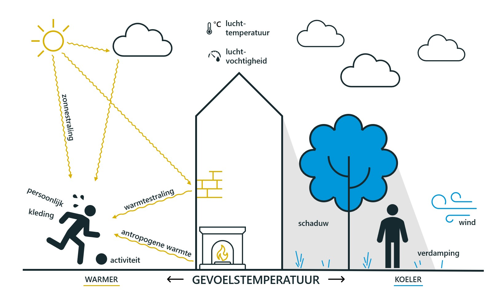
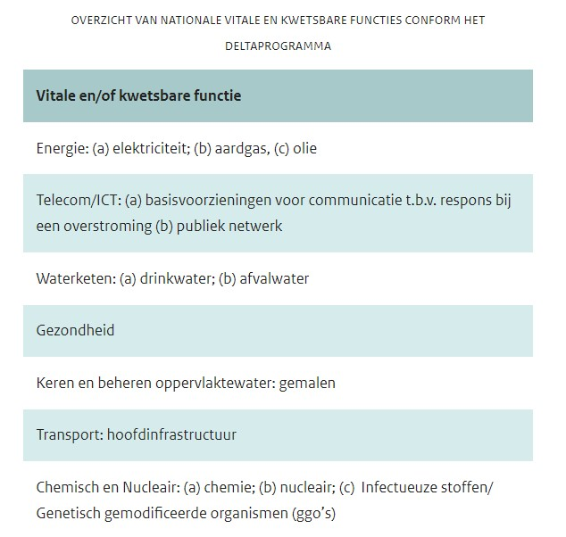

## Overzicht van bestaande systemen

*Overzicht van bestaande softwaresystemen voor klimaatadaptatie-processen, -monitoring, opslag en verstrekking van klimaatadaptatiegegevens, etc.* 

### Klimaatadaptatieprocessen

**Vragen**
 * Welke processen bestaan er al?
 * Hoe zien die eruit?
 * Welke onderdelen in de keten zijn al gestandaardiseerd?
 * Hoe ziet de standaard nu uit?
 * Op welke punten in de keten is nog behoefte aan standaardisatie?

#### Stresstest
"Uit de stresstest volgt ruimtelijk inzicht in kwetsbaarheden, nog zonder waardeoordeel. Of de kwetsbaarheden daadwerkelijk een probleem vormen en of er maatregelen moeten worden genomen, wordt afgewogen tijdens de risicodialoog."

"Het procesverloop van de risicodialoog ligt niet vast. Er zijn verschillende routes mogelijk. Maar meestal zal in wisselwerking met de stresstest een ‘van grof-naar-fijn-aanpak’ worden gevolgd. Daarbij wordt eerst, als voorbereiding op de dialoog, voor de vier klimaatthema’s een verkennende stresstest uitgevoerd met gebruik van landelijk of regionaal beschikbare basisinformatie. De resultaten hiervan zijn voeding voor de dialoog. Daar kan worden besloten dat meer informatie of meer detail nodig is. Er volgt dan een stap waarin informatie op maat wordt gecreëerd. Ook de resultaten hiervan gaan naar de dialoog. Het kan ook voorkomen dat eerst een risicodialoog plaatsvindt, nog voordat er een stresstest is uitgevoerd. Bijvoorbeeld na een calamiteit door extreem weer."

"De stappen in de stresstest en de wisselwerking tussen stresstest en risicodialoog zijn verbeeld in onderstaande infographic:"

<figure>
   
   <figcaption>Infographic Stresstest (Bron:
      <a href="https://klimaatadaptatienederland.nl/stresstest/bijsluiter" target="_blank">bijsluiter stresstest</a>)
   </figcaption>
</figure>

**Gebruik basisinformatie**
 1. Hoe maak je een gedetailleerde gevoelstemperatuurkaart?
 1. De kaart met het aantal warme nachten in de Klimaateffectatlas te bekijken.
 1. De kaart met de gevoelstemperatuur in de Klimaateffectatlas te bekijken.
 1. Ieder gevolg uit de mindmap hitte te overwegen: Speelt dat gevolg hier? Is de blootstelling relevant? Zo ja:
    * Waar speelt het?
    * Welke factoren beïnvloeden de gevoeligheid voor gevolgen?
    * Wat zijn de niet-klimatologische factoren die de omvang van de gevolgen kunnen beïnvloeden (bijv. vergrijzing in een bepaalde wijk)
    * Zijn er al maatregelen genomen, of nog niet?

### Hitte - Informatiebehoefte

#### Gevoelstemperatuur

 > Bron: [klimaateffectatlas: hittestress - gevoelstemperatuur](https://www.klimaateffectatlas.nl/nl/hittekaart-gevoelstemperatuur)

"Welke invloed hebben weer en omgeving op de *gevoelstemperatuur*? Het weer bepaalt voor een deel de gevoelstemperatuur. Het weer is niet alleen de *luchttemperatuur*, maar ook de *zonnestraling*, *windsnelheid* en *luchtvochtigheid*. Hoe sterker bijvoorbeeld de straling van de zon en hoe minder wind, hoe hoger de gevoelstemperatuur. Ook de *omgeving* bepaalt voor een deel de gevoelstemperatuur. In de *schaduw* van *gebouwen* en *bomen* is de gevoelstemperatuur lager dan in de volle zon. *Planten* verkoelen de omgeving doordat ze water *verdampen*. Een omgeving met veel *straten* en gebouwen warmt juist meer op, doordat straten en gebouwen de warmte van de *zon vasthouden*. Daarnaast kunnen gebouwen verkoelende *wind blokkeren*. De gevoelstemperatuur in stedelijk gebied is dan ook vaak hoger dan in landelijk gebied."

**Kenmerken: Weer**
 * Luchttemperatuur
 * Zonnestraling
 * Windsnelheid
 * Luchtvochtigheid

**Kenmerken: Omgeving**
 * Schaduw
 * Gebouwen
 * Bomen
 * Planten
 * Straten

<!-- <a> tag om <figure> heenbouwen om klikbare afbeelding te maken? -->
<figure>
   
      
   <figcaption>Infographic Gevoelstemperatuur (Bron:
      <a href="https://klimaatadaptatienederland.nl/stresstest/bijsluiter" target="_blank">bijsluiter stresstest</a>)
   </figcaption>
</figure>

"De gevoelstemperatuur stijgt in het WH-scenario met ongeveer 3 °C in 2050. Het WH-scenario kenmerkt zich door een wereldwijde sterke temperatuurstijging en een grote verandering in de luchtstromen. In de zomer betekent dit een toename van zonnestraling en meer oostenwind, waardoor er minder neerslag valt en de temperatuur in de zomer meer stijgt. De rechterkaart houdt geen rekening met mogelijke extra verstedelijking, die kan leiden tot een nog verdere temperatuurstijging in 2050." 

#### Ontwikkeling Standaard Stresstest Hitte (RIVM, 2020)
Onderstaande lijst bevat een eerste verzameling van informatiebronnen die gebruikt (kunnen) worden voor het onderwerp hitte.
Deze eerste ruwe opzet is gebaseerd op het RIVM-rapport: *Ontwikkeling Standaard Stresstest Hitte*, hoofdstuk 4. 

#### Inventarisatie mogelijke informatie-objecten

**Gebouwen**
    * **Objectkenmerken**: Locatie, Bouwjaar, Energielabel
    * **Doel**: -
    * **Bron**: -

**Kwetsbare (bevolkings-)groepen**
    * **Objectkenmerken**:
    * **Doel**: -
    * **Bron**: -

**Ziekenhuizen**
    * **Objectkenmerken**: Locatie
    * **Doel**: -
    * **Bron**: -

**Klimaatschade** (financieel?)
    * **Objectkenmerken**: Kosten ziekenhuisopnamen
    * **Doel**: Geeft inzicht in toename van kosten van ziekenhuisopnamen.
    * **Bron**: Klimaatschadeschatter van het NKWK

**Groenvoorzieningen** (parken, groenstroken, grasvelden, moestuinen)
    * **Objectkenmerken**: Locatie, Type
    * **Doel**: Geeft inzicht in de locaties waar problemen op kunnen treden.
    * **Bron**: -

**Bomen**
    * **Objectkenmerken**: Locatie, Kwetsbaarheid
    * **Doel**: ~~Geeft inzicht in de locaties met kwetsbare bomen~~
    * **Bron**: Bomenbestand

**Buitenruimten** (publieke ruimte met recreatief gebruik: buitenruimten, terrassen en parken)
    * **Objectkenmerken**: Locatie, Type
    * **Doel**: geeft inzicht in waar overlast kan ontstaan
    * **Bron**: -

**Koelteplekken** (Stadsstranden, Fonteinen, Parkjes)
    * **Objectkenmerken**: Locatie, Type
    * **Doel**: Inventarisatie van aangename plekken om te vertoeven tijdens tropische dagen
    * **Bron**: -

**Festivals en evenementen**
    * **Objectkenmerken**: Locatie, Datum, Tijdstip, Bezoekersaantal(?)
    * **Doel**: -
    * **Bron**: -

**Gebiedsfuncties** (wonen, werken, bedrijven, ontspanning)
    * **Objectkenmerken**: Locatie, Type
    * **Doel**: Om te bepalen welk type gebied voldoende koel ingericht moet zijn.
    * **Bron**: -

**Nog sorteren**

 - Afstand-tot -koelte kaarten om te bepalen welke gebieden op onvoldoende afstand van een koelteplek liggen.
 - Veel voorkomende locaties van buitenwerkers.
 - Overzicht van de locaties van scholen en kinderopvangcentra.
 - De locatie of de lengte van bekende en kwetsbare drinkwaterleidingen. -Schaduw- en groenanalyses  om te bepalen wat de mogelijkheden zijn van schaduw en groene oppervlakken voor het verkoelen van het netwerk.
 - Ramingen van de watervraag in de toekomst, inclusief een hitte-effect, vergeleken met de productiecapaciteit.
 - KEA-kaart met het aantal aaneengesloten dagen waarbij water warmer is dan 20 °C  geeft inzicht in de locaties waar waterkwaliteit een probleem kan geven. 
 - KEA-kaart met het aantal zomerse dagen (25 °C of meer) nu en in de toekomst  geeft een indicatie van de toename van de problemen met betrekking tot waterkwaliteit.
 - Locaties van ondiepe en stilstaande waterlichamen  geeft inzicht in de meest kwetsbare waterpartijen.
 - Overzicht van zwemlocaties in de gemeente.
 - De locatie van de energiecentrales, in combinatie met de kwetsbaarheid van het koelwater bij hitte en droogte.
 - Locaties van de railinfrastructuur om te bepalen waar de kwetsbare plekken zijn.
 - Locaties van de beweegbare stalen bruggen  om te bepalen welke plekken kwetsbaar zijn. 
 - Locaties van asfaltwegen.
 - Verkeersintensiteiten om te bepalen welke drukke plekken prioriteit hebben bij het nemen van maatregelen.
 - Locatie van de energiecentrales en informatie over hun specifieke gevoeligheid voor problemen met de koelwatervoorziening.
 - Inzicht in de afname van de rivierafvoeren

**Nog geen plek**
 - Basiskaarten gevoelstemperatuur Plekken waar het zo heet is dat mensen gezondheidsklachten kunnen krijgen, en laat zien waar het ontbreekt aan plekken om verkoeling te vinden

**Methodiek**
 - Schaduwanalyses om te bepalen wat de mogelijkheden zijn van schaduw voor het bieden van verkoeling.

#### Informatiebehoefte KEA (kaartverhalen)

<figure>
   
   <figcaption>Overzicht vitale functies (Bron:
      <a href="https://klimaatadaptatienederland.nl/stresstest/bijsluiter/vitaal-kwetsbaar/" target="_blank">bijsluiter stresstest</a>)
   </figcaption>
</figure>

<figure>
   
   <figcaption>Basiskaarten (Bron:
      <a href="https://www.klimaateffectatlas.nl/nl/kaartverhalen" target="_blank">klimaateffectatlas (KEA)</a>)
   </figcaption>
</figure>

<figure>
   
   <figcaption>Kaarverhalen (Bron:
      <a href="https://www.klimaateffectatlas.nl/nl/kaartverhalen" target="_blank">klimaateffectatlas (KEA)</a>)
   </figcaption>
</figure>