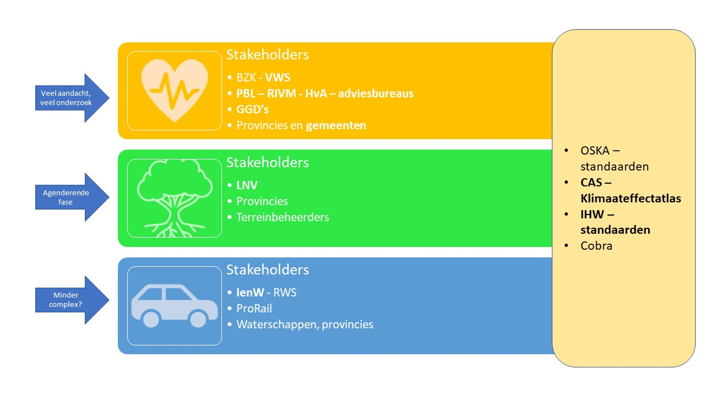

## Stakeholders

*overzicht van brede speelveld aan stakeholders inclusief hun informatiebehoefte op gebied van hitte* 

### Breed speelveld
Een breed speelveld aan stakeholders is betrokken bij hitte. Naast de rijksoverheid zijn de regionale en lokale overheden betrokken. Met name de lokale overheden, zoals de gemeenten, voeren de stresstesten m.b.t. hitte uit, maar ook Rijkswaterstaat voert deze stresstesten uit voor de rijksinfrastructuur. Vanuit de markt zijn er diverse partijen die een (verdiepende) stresstest aanbieden. Rondom hitte zijn ook nog veel vragen. Kennisinstituten, markt- en onderwijspartijen spelen een belangrijke rol in het vele onderzoek wat nog plaats vindt.

Vanuit de rijksoverheid spelen verschillende ministeries een rol in het hittedossier. Het ministerie van IenW heeft een coördinerende en stimulerende rol m.b.t. de Nationale klimaatadaptiestrategie (NAS) en het Deltaprogramma. Het ministerie van VWS is verantwoordelijk voor de gezondheid in relatie tot hitte, LNV heeft deze rol voor de natuur in Nederland en BZK staat aan de lat voor klimaatadaptief bouwen. Daarnaast is bijvoorbeeld het ministie van V&J mede-verantwoordelijk voor de vitale infrastructuur, zoals elektriciteit en drinkwater. Als vitale infrastructuur uitvalt door hitte, kan dat grootschalige maatschappelijke ontwrichting veroorzaken. 

Op het gebied van standaardisatie binnen klimaatadaptatie is er het samenwerkingsverband Overleg Standaarden Klimaatadaptatie (OSKA). In OSKA werken overheden, marktpartijen, kennisinstituten en standaardisatie-organisaties met elkaar samen. OSKA wil bevorderen dat klimaatadaptatie snel een plek krijgt in nieuwe en bestaande standaarden.

Om de informatiebehoefte van dit brede speelveld in kaart te brengen zijn 21 stakeholders geïnterviewd, afkomstig van:
- IenW
- LNV
- VWS
- Rijkswaterstaat
- Provincie Noord-Brabant
- Gemeente Rotterdam
- GGD
- PBL
- RIVM
- Unie van Waterschappen
- Informatiehuis Water
- OSKA
- Climate Adaptation Services (CAS)
- Klimaatverbond
- Cobra
- Hogeschool van Amsterdam

De stakeholders zijn bevraagd naar hun rol en het belang in het hittedossier, hun informatiebehoefte, de knelpunten en de verbeterpunten in de informatievoorziening rondom hitte en tot slot wat een mogelijke oplossing is, zoals een begrippenkader en/of een informatiemodel.

Hieronder staan de bevindingen per stakeholder aangegeven. De bevindingen uit het interview met PBL zijn verwerkt in de paragraaf over [monitoring](#monitoring).

### Stakeholders op gebied van gezondheid
Betrokken stakeholders zijn o.a. VWS, provincies, gemeenten, GGD's, RIVM, HvA, Klimaatverbond, ZonMW en diverse marktpartijen.

#### VWS

**Rol en belang** 
Rol van VWS is rondom gezondheid en gedrag. Hoe omgaan met adaptieve maatregelen en gedragscodes.

**Informatiebehoefte**
Via 3G's: 
- Gebied: LNV, IenW, BZK: geen hitte-eilanden, schaduw belangrijk
- Gebouw: IenW, BZK, LNV: 
     - Voor gebouwen is het belangrijkste dat ze 's nachts afkoelen. 
     - Vergroening van de stad. Heeft beperkte waarde. Voor koelte, biodiversiteit, gezondheid, sporten, bewegen, recreëren.
- Gebruiker, gezondheid, gedrag: Hiervoor is Nationaal hitteplan uit 2007 (ouderen, voldoende drinken). Effectiviteit nooit geëvalueerd. Ook lokale hitteplannen. Effectiviteit zou je in samenhang willen onderzoeken. Netwerk rondom hitteplannen: VWS, koepels zorgorganisaties, Rode Kruis, GGD's. Waar wonen de kwetsbare mensen (o.a. hart- en vaatziekten, asma).

**Knel- en verbeterpunten**
- Isolatie van de woning in verband met energie. Wat betekent dit voor hitte. VWS wil dit weten. BZK wil dit voor gebouwen weten. Hiervoor nieuwe norm: TOjuli. Waar nieuwbouw huizen aan moeten voldoen, staat in Bouwbesluit.
- Zie ook Factsheet RIVM groen en gezondheid.

**Oplossingen**
Woordenboek is mogelijk behulpzaam bij de samenhang tussen de 3 G's: gebied, gebouw, gebruiker

#### Gemeente Rotterdam

**Rol en belang** 
Adviseur hitte en droogte. Gemeente Rotterdam doet veel met hitte. Gemeente heeft kaarten over gevoelstemperatuur, hitte-eilanden. 

**Informatiebehoefte**
Eerst gewerkt met de landelijke data uit Klimaateffectatlas. Maar gemeente werkt nu met Tygron, software die kan modelleren. Met Tygron kan de gemeente de gevoelstemperatuur en luchtvochtigheid modelleren op basis van recept van de [bijsluiter gestandaardiseerde stresstest hitte](#bijsluiter-gestandaardiseerde-stresstest-hitte). Gevoelstemperatuur is wel een lastig begrip, want het is lokaal zeer verschillend. Daarnaast speelt de vraag 'hoe goed is het model?'. Worden bepaalde factoren in het model wel/niet meegenomen.

**Knel- en verbeterpunten**
- De binnentemperatuur is eigenlijk veel belangrijker, want mensen slapen binnen. Gevoelstemperatuur binnen is voor een gemeente lastiger te sturen want het betreft vastgoed. NKWK-onderzoek vindt momenteel plaats naar de binnenruimte.
- Er zijn momenteel twee kaarten voor de gevoelstemperatuur, de kaart die is uitgewerkt door Witteveen +Bosch (W+B) volgens het landelijke recept en een methode ontwikkeld door Nelen & Schuurmans (N&S) met andere aannames. Daardoor is het lastig te vergelijken. Het zou handig zijn als dezelfde uitgangspuntenn worden gehanteerd.
- Dit geldt zowiezo voor onderzoek/uitbestedingen aan bureaus. Er worden veel aannames gedaan. Praten langs elkaar.
- Er is geen standaard voor afstand tot groen. In de Klimaateffectatlas is wel de kaart afstand tot koelte opgenomen. Maar elke gemeente geeft eigen invulling aan groen in relatie tot koelte; niet alle groene plekken zijn koel. De gemeente Rotterdam gebruikt dan ook eigen methode. Zo'n landelijk beeld heeft dan geen meerwaarde. De behoefte is aan meer detailniveau. Er zouden meer handvaten moeten komen, zoals publicatie van HvA.
- Landelijk Nationaal hitteplan is effectief, maar als gemeente moet je het gedetailleerder maken.
- Voor in huis: BENG normen. 
- 

**Oplossingen**
Informatiemodel is een lastig begrip. Met name gesproken over woordenboek. In eerste instantie is het antwoord dat de mensen die zich echt met hitte bezig houden echt goed weten waar ze het over hebben. Daar is onderling geen spraakverwarring. Maar onder niet-experts is er wel begripsverwarring. Vooral begrippen als hittestress, gevoelstemperatuur, hitte eiland. Deze begrippen worden door mensen die geen expert zijn op het gebied van hitte, maar generalist zijn, wel door elkaar heen gebruikt. Er zijn heel veel mensen die wel meepraten over hitte maar geen specialist zijn. Er wordt wel afgevraagd of een woordenboek gaat helpen, want de gemeente verwacht niet dat elke generalist de moeite zal nemen om een woordenboek te raadplegen. De expert daar hoef je het niet voor te doen, want in overleggen waar het echt over hitte gaat, dan weten de mensen waar het over gaat. Maar mogelijk kan het wel helpen bij uitbestedingen (verschillende aannames). In dit kader wordt aangegeven dat hitte een nieuw onderwerp is. Iedereen is op zoek naar informatie. Iedereen heeft weer andere onderzoeken gelezen. Er is geen één duidelijke lijn. 

Richtlijnen mmaken. Provincies doen dat ook, bijvoorbeeld provincie Zuid-Holland. Voor voorbeelden van richtlijnen wordt verwezen naar HvA:
- % schaduw op looproutes
- Verblijfsobjecten
- Afstand tot koele plek
- Hoeveel m2 koele plek per inwoner
- % groen dat er moet zijn bij een ontwikkeling in de buitenruimte

#### GGD

**Rol en belang** 
Adviseren over groene en gezonde leefomgeving. Zijn betrokken bij het opstellen van de stresstesten en de lokale hitteplannen. Betreft niet alleen fysieke aspecten zoals temperatuur maar de kwetsbaren, ouderen (75+).

**Informatiebehoefte**
Effecten van hitte op gezondheid zijn lastig te meten, omdat ze niet heel eenduidig zijn. Er is vaak sprake van een combinatie van factoren (onderliggend lijden, maar ook de duur van een hittegolf of de type woning). Hittedoden zoals het CBS die registreert is daarom vrij onbetrouwbaar getal. 

Relevante parameters zijn:
- Hitte buiten
- Hitte binnen (afhankelijk van gebouwkenmerken en gedrag).
- Gebouwkenmerken: plat dak, flat/laagbouw, bouwjaar, gevel op het zuiden
- Is er een relatie tussen energielabel en binnentemperatuur?
- Demografie
- Koele plekken kaarten (schaduw, gekoelde gebouwen); kunnen 75+-ers daar komen? Doen ze dat ook als het heet is?

**Knel- en verbeterpunten**
- Effectiviteit van maatregelen (zonwering, ventilatie) zijn moeilijk te monitoren omdat het met individueel gedrag te maken heeft.
- Gezondheidsmonitor van 25 GGD's, RIVM en CBS (vierjaarlijks, 500.000 respondenten): mogelijk uit te breiden met vragen over hitte. Data is echter alleen beschikbaar voor GGD's en niet landelijk wordt ontsloten.
- GGD's adviseren de Klimaateffectatlas uit te breiden met aspecten m.b.t. de binnenruimte en gedrag. 
- Om beter in beeld te brengen wat de hitte in de woning is; betreft ook kenmerken van de woning (bouwjaar, wijktypologie, aantal verdiepingen, platte daken, ramen op het zuiden) en verkoelingsmaatregelen (zonwering, ramen open ’s nachts).
- Rondom groen is een lastige semantiek: groen als recreatie, als schaduw, als verkoeling door verdamping.
- Mogelijke rol satellietdata in groenherkenning?
- Hittekaarten / hitte-eilandeffect: bedrijfsterreinen zijn ook hitte-eilanden, maar wonen er geen mensen (er werken wel mensen). Hoogste risicogebied in Amsterdam is bijvoorbeeld niet het centrum, maar de ring met arme wijken met oude huizen en weinig groen. Dus in de hittekaarten niet alleen temperatuur meenemen, maar ook andere parameters zoals sociaal-economische factoren (is het mogelijk om wel of geen airco of zonwering te kopen).
- NAS-bollenschema's zijn zeer volledig.

**Oplossingen**
Bij hitte niet alleen de temperatuur buiten en binnen meenemen maar ook andere aspecten, zie informatiebehoefte. Voordelen van standaardisatie is dat het nog  inzichtelijker wordt, want het is vergelijkbaar.

Klimaatadaptatie is een complex probleem dat veel samenwerking vraagt. Klimaatgeletterdheid moet eerst omhoog, zodat adaptief handelen in de kern van het handelen komt.

#### Hogeschool van Amsterdam 

**Rol en belang** 
Interdisciplinaire onderzoeksgroep hitte in de stad. Lector is ook partime werkzaam bij Tauw.

**Informatiebehoefte**
Kernvragen van hitte zijn:
- Hoe heet wordt het? Luchttemperatuur, gevoelstemperatuur, nachttemperatuur.
- Hoe snel gaat de opwarming?
- Hoe kan je de buitenruimte zo inrichten dat je klimaatbestendig wordt?

Onderzoeksvragen verschuiven meer van buitenruimte naar binnenruimte:
- Gebied: groen/grijs 
- Gebouw: isolatie en zonwering
- Gebruiker: hitteplannen en gedrag

Praktische handreiking hitte in de woning (welke woningen extra risico, welke typen huizen, welke adaptatiemaatregelen (zoals zonwerking, airco), NKWK-onderzoek hitte in de woning (beleving en metingen) in samenwerking met Klimaatverbond, TAUW en GGD. Onderzoeksresultaten komen terug in de Klimaateffectatlas. Belangrijk programma is [Nationaal Kennisprogramma Water en klimaat (NKWK)](https://www.waterenklimaat.nl/). Ook voor monitoring van klimaatadaptatie en ook voor (belevings)onderzoeken hitte in de woning.

Belangrijkste parameters uit de Klimaateffectatlas zijn:
- Gevoelstemperatuur
- Nachttemperatuur (wordt geupdated, mogelijk met Citizen science)
- Percentage groen, schaduw en koelte (afstand tot koelte)

Ook gekoppeld aan de door HvA opgestelde richtlijnen voor een hittebestendige stad. Drie [ontwerprichtlijnen](https://www.hva.nl/urban-technology/gedeelde-content/publicaties/publicaties-algemeen/praktijkonderzoek-hitte-richtlijnen.html) voor een hittebestendige inrichting van de buitenruimte zijn opgesteld. Deze voorgestelde richtlijnen zijn in het onderzoek concreet met grenswaarden ingevuld (bijvoorbeeld 300 meter tot een koele plek, of 40 % schaduw op loopgebieden).

**Knel- en verbeterpunten**
- Hitte-eilandkaart is lastig. Hierop ook bedrijventerrein, maar er wonen geen mensen. Mogelijk wel weer te gebruiken voor waterberging. Is geen goede monitorparameter.
- Voor monitoring is het zinvol om de volgende parameters te monitoren:
   - Schaduw
   - Groen
   - Afstand tot koelte
   - Gevoelstemperatuur (is eigenlijk ook een schaduwkaart)
- Kwetsbare ouderen is ook een lastige parameter. Hoe bepaal je de kwetsbare oudere?
- Richtlijnen voor herinrichting gebieden (buitenruimte) is eenvoudig houden. Groen is maatregel voor klimaatadaptatie en vergroot ook leefbaarheid. Schaduw toevoegen is de enige echte oplossing en daarna verdamping.
- De mindmap Hitte in de stad en het NAS-bollenschema zijn aanvullend. Het NAS-bollenschema is veel uitgebreider, maar minder praktisch (meer een ‘denk hieraan’ plaat).
- Vanuit HvA is infrastructuur geen hittevraag. Zijn praktische problemen die gemitigeerd moeten worden (bijv. bruggen koelen) of bij ontwerp worden opgelost.

**Oplossingen**
Begrippenkader is niet per se nodig. Over de termen in de mindmap hitte in de stad is al goed nagedacht. Het sluit aan op Klimaateffectatlas. Over de Klimaateffectatlas is consensus, adviesbureaus doen het wel beetje anders. Standaardisatie is niet per se nodig.

#### Klimaatverbond

**Rol en belang** 
Hitte in relatie tot gezondheid en daarin de 3G aanpak: gebied, gebouw en gezondheid. Het gaat over de gezondheid van de mens. Elk domein heeft z'n eigen vraagstuk: wat weten we wel en wat weten we niet. Elk domein vraagt verdieping. Harde gegevens m.b.t. gezondheid zijn alleen de CBS-statistieken m.b.t. oversterfte, gegevens over de spoedeisende hulp in relatie tot hitte zijn niet bekend. Via de huisartsen wordt via NIVEL wel een en ander bijgehouden

**Informatiebehoefte**

Hitte-eiland effect: RIVM en HvA mee aan de slag. HvA heeft hittebestendige stad opgesteld met 3 richtlijnen:
-	Afstand tot koelte (binnen 300m koele plek)
-	% schaduw looproutes
-	% groen

Hitteplan: Nationaal voor bewustwording en communicatie mbt adviezen. Om dichter bij de doelgroep te komen: lokale hitteplannen op gemeentelijk niveau. Door hitteplannen is de effectiviteit toegenomen, maar de onderbouwing loopt achter. Klimaatverbond pleit voor een hitte regisseur.

Hitte-indicatoren:
- Gezondheidsmonitor, de broosheid van mensen. Kwetsbare mensen in kaart gebracht door RIVM (75+, soms 80+, mensen met chronische ziekten of bepaald medicijn gebruik, jonge kinderen)
- Woningen: per woningtype label voor hitte verder ontwikkelen
- Hittekaarten: waar is het warm?

Deze 3 indicatoren brengen de kwetsbaarheid in beeld. Volgende stap is het nemen van maatregelen en effectiviteit te bepalen. Arcadis heeft rekenmodel ontwikkeld m.b.t. effectivitteit van de woning (buiten zonwering, isolatie woning of directe omgeving vergroenen). Maar hitte betreft een combinatie van factoren (eenzaamheid, immobiliteit) gekoppeld aan gedrag (drinken, ventilate). En daarnaast is afwegingskader belangrijk: energiebesparing versus hitte. 

**Knel- en verbeterpunten**
Er loopt momenteel veel onderzoek via NKWK en ZonMW:
- NKWK: Per buurt: hoe hittegevoelig zijn de woningen (Tauw trekker)
- NKWK:	Gezondheid van de bewoners
- ZonMW: Warm aanbevolen, kijken naar de fysiologie van het lichaam zelf.

Discussiepunten zijn:
- Heeft groen nu wel of geen impact op de vermindering van hitte.
-	Hoge nachttemperaturen: effect op mensen nog onbekend. Ook in relatie tot arbeid.

Bij hittedossier staan we nog aan het begin. Effect van hitte zit niet in het gebied maar vooral in de aanpak van de woning en het gedrag van de mens. Eigenlijk is belevingsonderzoek nodig gekoppeld aan bijvoorbeeld hittelabel van woning, soort bewoners en gedrag, wel of niet geïsoleerd.

**Oplossingen**
Begrippenkader: Dit heb je nodig, zodat duidelijker is wat de definitie van bepaalde zaken zijn. 

### Stakeholders op gebied van natuur
Betrokken stakeholders zijn o.a. LNV, provincies en terreinbeheerders.

#### LNV

**Rol en belang** 
Betrokken bij de [Actielijnen klimaatadaptatie natuur](#actielijnen-klimaatadaptatie-natuur), welke programma's en projecten spelen er rondom klimaatverandering en natuur. Proberen de verbinding te zoeken, kennisvragen uit te zetten, wat is het kader?

Klimaatverandering heeft impact op de natuur, maar de natuur kan ook worden ingezet als maatregel voor klimaatadaptatie.

**Informatiebehoefte**
Klimaatadaptatie zowel in het landelijke als stedelijke gebied. Vergroening in het landelijk gebied, rond de 17.000 ha. Water- en bodemsysteem en systeemdenken moet leidend worden in beleid. Waterbeschikbaarheid is direct gerelateerd aan hitte in relatie tot de natuur. Waterbodemsysteem is leidend, maar nog niet geoperationaliseerd. 

**Knel- en verbeterpunten**
- De semantische discussie over wat ‘hitte’ is: Spreek je dan over langere korte periodes met een hogere temperatuur –langere/meer hittegolven-, of heb je het over een hogere gemiddelde temperatuur. Dat laatste, die constante temperatuurverhoging is voor de natuur een groter probleem. Een hittegolf hoeft voor de natuur niet meteen problemen op te leveren als er voldoende water is. Een langdurige temperatuursverhoging heeft meer gevolgen. 
- En wat is klimaatadaptief in relatie tot hitte: moet je dan tot een harde grens komen?
- Nuance verschillen qua (korte of lange) termijn en schaalniveaus verschilt tussen de verschillende bestuurslagen (rijk, provincie, gemeente). Dit heeft verschil in hoe je naar hitte kijkt én hoe je het aanpakt. 

**Oplossingen**
Een woordenboek om dezelfde taal te spreken is wel van belang, tussen de ministeries is er echter een verschillende scope. LNV kijkt anders naar de begrippen dan de NAS of andere partijen. LNV zou er belang bij hebben wanneer de woorden weer los worden getrokken van hun huidige context. Hitte is nu geassocieerd met mensen, maar zou ook met natuur moeten worden geassocieerd.

### Stakeholders op gebied van infrastructuur
Betrokken stakeholders zijn o.a. IenW, RWS, ProRail, Waterschappen, provincies.

#### IenW (in relatie tot infrastructuur)

**Rol en belang** 
Klimaatadaptatie, in relatie tot vitale en kwetsbare infrastructuur. Klimaatbestendigheid worden moet worden meegenomen bij vernieuwing, beheer van infrastructuur en assets. Bepaald moet worden wat het rijk hierin gaat doen en wat de regio. In de DPRA zijn 13 vitale en kwetsbare functies benoemd, zoals elektriciteit, gas, telecom, water, objecten, hoofdinfrastructuur. Ministerie van V&J   verantwoordelijk voor weerbare infrastructuur voor vitale processen. 29 processen zijn geïdentificeerd die vitaal zijn (denk aan datacentra, drinkwater, etc).

**Informatiebehoefte**
IenW is alleen verantwoordelijk voor de eigen infrastructuur/netwerken (spoor, hoofdwegen, vaarwegen). Deze netwerken wil je klimaatbestendig maken. Hiervoor heb je wel normen en eenzelfde taal nodig. Waar heb je het over? Hoe moet je interventie plegen bij hitte. Wat is het risico en wat moet je concreet doen. Voor precieze informatiebehoefte wordt verwezen naar collega's en RWS. 

Voor informatiebehoefte wordt verder verwezen naar de NAS-bollenschema's. Dit is een belangrijke basis. Belangrijkste is hoe we ministeries, andere overheden, uitvoerders bewuster maken van dit soort risico’s. En hoe je vervolgens maatregelen hiertegen neemt. Belangrijk is dan wel dat je de assets in beeld hebt.

Cascade-effecten zijn nog niet in beeld. Hier is wel behoefte aan: wat als de infrastructuur uitvalt, wat valt er dan nog meer uit?

**Knel- en verbeterpunten**
RWS heeft een eigen Klimaateffectatlas. Dit is wel lastig ten opzicht van de Klimaateffectatlas. 

Zoals aangegeven gaat IenW alleen over de eigen infrastructuur. EZK gaat bijvoorbeeld over de energienetwerken. Vraag is of EZK op de hoogte is van klimaatadaptatie en of hitte hier wordt meegenomen. Mogelijk EZK interviewen of misschien de netbeheerders zelf. IenW heeft een coördinerende rol vanuit klimaatadaptatie: integraal en afgestemd. Alleen ligt veel ook bij andere ministeries, overheden: LNV, VWS, RWS, gemeenten, waterschappen. 

**Oplossingen**
Begrippenkader: IenW geeft aan normen en eenzelfde taal nodig zijn.

Elke twee weken is er een breed klimaatadaptatie-overleg met meerdere ministeries en aanverwante partijen (oa CAS, Klimaatbestendig NL). Bredere groep experts zit aan aan tafel. Suggestie wordt gegeven om dit project ook in het brede klimaatadaptatie-overleg  te presenteren en feedback te vragen.   

### Stakeholders op gebied van informatievoorziening
Betrokken stakeholders zijn o.a. IenW, RIVM, WUR, Informatiehuis Water, OSKA, Climate Adaptation Services (CAS), Cobra en andere marktpartijen zoals Tauw.

#### IenW (in relatie tot informatievoorziening)

**Rol en belang** 
Klimaatadapatie, in relatie tot bodem, water, gebouwde omgeving en werkgroep stresstesten. 

**Informatiebehoefte**
Hitte is grootste probleem wat onderschat wordt. Nieuw onderwerp met nog veel vragen. Hitte treft gebouwaanpassingen, ruimtelijke aanpassingen en gedrag. Waarbij gedrag de belangrijkste factor is. En voor gedrag is nog te weinig aandacht.

Klimaateffectatlas is goed startpunt om gesprek te starten.

**Knel- en verbeterpunten**
Wat is het probleem rondom hitte? Zijn het de hete nachten of bijvoorbeeld de plekken waar een hoge dag- en nachttemperatuur is en waar kwetsbare mensen wonen. Dit moet je eerst weten voordat je oplossingen kan denken.

Monitoring van hitte: vanuit theorie een mooi idee, maar in praktijk lastig. Hitte is niet gebiedsgericht. Hittestress kan in het ene gebouw wel voorkomen en in de woning ernaast niet. 

Uniformering stresstesten: Ambitie is uniformiteit, maar gemeenten zijn verantwoordelijk voor de stresstesten en aanpak. Als je wilt uniformeren dan moet je eigenlijk de verantwoordelijkheid weghalen bij de gemeenten en nationaal bepalen.

**Oplossingen**
Start kan wel zijn zelfde begrip van de termen te hebben. Hitte moet meer gaan leven bij gemeenten en GGD’s en ook de burger.

#### RIVM
**Rol en belang** 

Het RIVM had coördinerende rol bij het ontwikkelen van de standaard voor de stresstest hitte. Het betreft de ontwikkeling van een gestandaardiseerde methode om een gedetailleerde **gevoelstemperatuurkaart** te maken en het opstellen van een leidraad voor de stresstest hitte. De methode is ontwikkeld door de WUR. De leidraad is opgesteld door de Hogeschool van Amsterdam.

**Informatiebehoefte**

Hitte in de woning te bepalen en welke impact heeft op de mens. Hiervoor zijn nodig:
- Gevoelstemperatuur
- Nachttemperatuur
- Temperatuur in huis gekoppeld aan gebouwinformatie 

**Knel- en verbeterpunten**

Gevoelstemperatuur:
- methode is te ingewikkeld, methode versimpelen zodat rekenen sneller gaat 
- baseren op hoogste temperatuur in laatste 10 jaar en windstil weer
- baseren op meer metingen en ook in meerdere steden
- baseren op basisregistraties

Temperatuur in huis:
- Aantal partijen (HvA, Klimaatverbond,Tauw, BZK) zijn bezig hiervoor een monitor op te zetten op basis van NETATMO-weerstations (https://weathermap.netatmo.com/). Deze stations meten binnen- en buitentemperatuur. In project willen ze deze informatie verzamelen en op de kaart zetten. 

Algemeen:
- Lacune is dat KNMI niet meet in de steden.
- Kwetsbare mensen in beeld. Dit wordt via NKWK onderzoek nu in beeld gebracht.
- Ook diverse hitte-projecten via ZonMW.

Combinatie van kaarten:
Nachttemperatuur en de temperatuur in huizen koppelen aan gebouwinformatie om zo de hitte in woningen te bepalen en welke impact dit heeft op de mens: hittedoden via CBS, ziekte of ziekenhuisopname via ziektemeldingen en andere zorgregistraties. Uiteindelijk kosten in beeld brengen. 

**Oplossingen**

Begrippenkader is handig hulpmiddel. Hierdoor krijg je minder spraakverwarrring.

Informatiemodel is misschien nodig voor de basisdata die gebruikt in de methodes zoals de gevoelstemperatuur. Mogelijk in toekomst hittestressmodel. 

Algemeen: Nog veel onduidelijk rondom hitte. Valt tussen wal en schip. Ook beleidsmatig: IenW of VWS; wie is verantwoordelijk?

Andere modellen:
- In Tygron zit hittestressmodule. HvA is hierbij betrokken.
- VITO (België) heeft hittemodel ontwikkeld waar de antropogene bronnen (airco’s, auto’s door de stad) in zijn meegenomen

#### Unie van Waterschappen / DPRA (in relatie tot bijsluiter stresstest hitte)

**Rol en belang** 
Stresstest hitte en bijsluiter gestandaardiseerde stresstest hitte. Met de stresstest worden de kwetsbaarheden in kaart gebracht. Vooral gemeenten voeren stresstesten uit. Voor hitte was, toen de stresstest werd opgesteld, nog weinig kennis. Met een consortium (HvA, RIVM, TNO, WUR, aantal adviesbureaus) is de bijsluiter opgesteld. 

**Informatiebehoefte**
De kwetsbare gebieden voor hitte bepaald door twee kaarten:
- Gevoelstemperatuurkaart
- Aantal hete, tropische nachten
 
Waar zijn deze gebieden? Deze gaan risicodialoog in. Wat kan gemeente doen om temperatuur te verlagen? Welk handelingsperspectief? Hiervoor wordt Mindmap Hitte (HvA) en de Bollenschema NAS gebruikt. Bijv. impact op infrastructuur, comfort binnen en buiten. Ook wordt naar routes gekeken: koele routes naar koele plek. Gemeenten, provincies, waterschappen krijgen tips voor handelingsperspectief.

Belangrijkste vragen zijn:
-	Wat is de norm? Deze vraag ligt nog op tafel. Hoe wordt die bepaald? Door de kwetsbaren en ouderen. Ook hoe een gebouw is ingericht speelt een rol. Hitte wordt nog steeds verschillend geïnterpreteerd. Er is geen grenswaarde.
-	Welke maatregelen moeten worden genomen? Meer groen, maar welk groen of de hoeveelheid groen. Dit soort vragen spelen nog steeds en hier wordt ook onderzoek naar gedaan.

**Knel- en verbeterpunten**

Gevoelstemperatuurkaart: 
-	Complexe kaart. Recept is opgesteld door RIVM, WUR. Met het idee dat gemeenten zelf de kaart kon opstellen. Gemeenten vonden echter lastig. Vervoglens is opdracht gegeven aan Witteveen +Bosch (W+B) om de landelijke gevoelstemperatuurkaart te berekenen. Deze kaart staat op de Klimaateffectatlas.
-	Nelen en Schuurman hebben ook een gevoelstemperatuurkaart gemaakt. Deze verschilt in details met de kaart op de Klimaateffectatlas. Deze verschillen geven discussies. De gebruikte brondata onderliggend is verschillend. Het zou handig zijn als die geüniformeerd worden, zodat je 1 landelijke kaart hebt.
	
Aantal hete, tropische nachten:
-	Deze kaart is ook verouderd. Nu opdracht gegeven aan Nelen & Schuurmans (N&S) om deze kaart te verbeteren. Tauw en HvA werken hier ook aan mee.

Monitoring:
- De vraag ‘hoe je de effecten van maatregelen kan meten’ is een belangrijke vraag. De vraag is ook gesteld door Delta commissaris. Er worden maatregelen genomen, dan verwacht je dat het gebied minder kwetsbaar is. Is dit dan ook zo? Dit is lastig om te bepalen. 
- De gebruikte modellen modeleren nu ook niet in dit detail (bijv. op straatniveau). 

**Oplossingen**
Begrippenkader: CAS heeft hierin al veel gedaan via de Klimaateffectatlas, maar mogelijk zijn er nog hiaten.

#### Rijkswaterstaat / IenW

**Rol en belang**
Breed georienteerd, met name op gebied monitoring klimaatadaptatie en evaluatie NAS. Eerste stap in monitoring is de herijking klimaatrisico's en impacts van PBL. Beleidsevaluaties doen met horizon 2050/2100.

**Informatiebehoefte**
Voor klimaatverandering de hele beleidscyclus monitoren. Dus niet alleen de gevolgen, de risico's en de impacts maar ook de beleidseffecten meten. Op basis hiervan weer nieuwe prioriteiten stellen. 

**Knel- en verbeterpunten**
Sluit aan bij de ISO (2021), Adaptation to climate change - Guidelines on vulnerability, impacts and risk assessment. First edition 2021-02. Reference number ISO 14091:2021(E). Het PBL gebruikt deze ISO standaard bij de herijking.

**Oplossingen**
Informatiemodel is nodig voor zowel de monitoring als de Klimaateffectatlas. Beide onderwerpen zijn ook verbonden met elkaar. Naast ruimtelijke aspecten ook niet-ruimtelijke aspecten meenemen, bijvoorbeeld het gezondheidsdomein. Ook in de monitoring.

#### Overleg Standaarden Klimaatadaptatie (OSKA)/NEN

**Rol en belang** 
Werkt bij NEN en is vanuit die rol bij OSKA aanhaakt. Doet verkenningen voor actieteams.

OSKA staat Overleg Standaarden KlimaatAdaptatie. OSKA wordt aangestuurd door OSKA Plenair, NEN vormt daarvoor het secretariaat. Aan het OSKA Plenair nemen veel verschillende stakeholders deel. OSKA Plenair bepaalt welke thema’s opgepakt gaan worden in verkenningen. In OSKA Plenair wordt alleen opgehaald wat er in de markt leeft. Als er behoefte is, dan kan er een verkenning worden gestart. IenW is betrokken bij OSKA.

In verkenningen worden de belangstellenden samen gebracht; peilen van de behoeften. Dit wordt vastgelegd in rapportages en er worden aanbevelingen gedaan. De uitvoer wordt niet opgepakt in verkenningen. Als dat aan de orde is, dan gaat het naar standaardisatieteams (dat kan bijvoorbeeld bij NEN zijn) of naar actieteams als het in de praktijk toepast moet worden. 

**Informatiebehoefte**
OSKA werkt nu aan de verkenning 'Hitte in de buitenruimte'. Uit deze verkenning komt naar voren dat er behoeften voor richtlijnen zijn. In het team hebben ze de 3 richtlijnen uit het onderzoek van HvA genomen voor hoe je een koele plek voor de mens kunt creëren. De gemeentes die deelnemen in de verkenning worstelen met welke richtlijn ze moeten opnemen in beleid. 

Bij de Verkenning ligt nu behoefte in de ontwerpfase; welke keuze maak ik in de maatregelen, welke maatregelen kies ik op welk moment, welke data is nodig. Ga je werken in een bestaand bebouwd gebied of is het een nieuwe omgeving. Dat is een ander uitgangspunt. Vervolgens/uiteindelijk wil je weten wat de effectiviteit is van de maatregel. De Hoe-vraag komt er dan bij kijken: hoe stel je dat vast? Iedereen is het er wel over eens, maak dat nu niet te ingewikkeld, maar maak het simpel in de basis.

**Knel- en verbeterpunten**
- Verkenning Hitte is opgepakt omdat er een behoefte is aan eenduidige kaarten voor hitte. 
- De Klimaateffectatlas is er, maar als je inzoomt naar lokaal niveau dan zijn er verschillen. Bij uitbestedingen is het mogelijk dat je twee verschillende antwoorden krijgt. Dit is voor de gemeenten lastig. 

**Oplossingen**
Een woordenboek wordt interessant gevonden.

Richtlijnen, procesbeschrijvingen zouden helpen voor degenen die de kaarten maken. Bijvoorbeeld over tijdstippen en welke data neem je mee. Definities en meetmethodes zijn hierbij erg belangrijk.

Nu 3 basisrichtlijnen:
  -  afstand tot koele plek voorstel 300 meter, 
  -  Percentage schaduw. Dit is gericht op looproutes. Dit wordt verschillend geïnterpreteerd.
  -  Percentage groen in de buurt, afhankelijk van wijktype.

Er is vooral behoefte aan kaarten. Wel komen bij kaarten ook weer issues op, zoals de definitie van wijken en buurten. CBS hanteert een andere indeling dan die gemeenten zelf gebruiken. 

#### Climate Adaptation Services (CAS)

**Rol en belang** 
Klimaatadaptatie, in dit kader bevraagt in releatie tot Klimaateffectatlas

**Informatiebehoefte**
De klimaateffectatlas heeft een sterke centrale rol voor stakeholders en ook voor bewustwording. De informatie is andersoortige informatie. Het betreft geen brondata, maar de best beschikbare informatie, vaak model/analyse resultaten. De status van de data is twijfelachtig. Het behoeft een kwaliteitsslag en dat kan mogelijk via standaardisatie van de data.

Hittestresskaarten in de Klimaateffectatlas zijn:
-	Gevoelstemperatuurkaart 
- Nachthittekaart

De gevoelstemperatuurkaart is ook weer input voor de afstand tot koelte. Stakeholders voeren op het laatste beleid.

Klimaateffectatlas richt zich op de buitenruimte, maar nu ook onderzoek naar de binnenruimte (HvA, Tauw)

**Knel- en verbeterpunten**

Gevoelstemperatuurkaart:
- Twee versies zijn momenteel beschikbaar. Een van deze versies staat in de Klimaateffectatlas
- Methode dient vernieuwd te worden, evenals de brondata.
- Alle partijen zijn akkoord om deze te standaardiseren. Het betreft meer een productbeschrijving dan een informatiemodel: bronbestanden, welke analyse; uitkomst; welke kwaliteitsaspecten. Voorstel CAS voor de scope is om deze kaart te standaardiseren en te vereenvoudigen. 

Nachthittekaart:
Voor deze kaart wordt momenteel nieuw ontwikkeld. Deze kaart is minder kansrijk om te standaardiseren.

Afstand tot koelte / koele plekken:
Wordt afgeleid van de gevoelstemperatuurkaart plus aanvullende eisen. 

Monitoring:
Verschillende aspecten kunnen gemonitord worden:
-	Hoeveelheid groen
-	Hoe ontwikkelt de gevoelstemperatuur zich
-	Afstand tot koelte

Verbeterpunten: 
- Basisregistraties inzetten als brondata, zoals de BGT. Bijvoorbeeld als indicatie voor groen, verharding.
- Ook satelietbeelden mogelijk als bron. Bij klimaatadapatie loop het gebruik van satelietdata achter. Watersector heeft al wel stappen gezet.

**Oplossingen**
Begrippenkader is mogelijk waardevollestap om te verkennen.

Informatiemodel: daar moeten we uiteindelijk naar toe, maar een IM is logischer voor ander thema bijv. wateroverlast. IM is bijna een soort digital twin.

#### Cobra

**Rol en belang** 
Leefbaarheid in kaart brengen m.b.v. remote sensing, luchtfoto's. Zowel de huidige als de toekomstige situatie. Het gaat over het effect van klimaat op groen en vice versa, de rol van groen op klimaat. 

**Informatiebehoefte**
Behoefte aan:
- Kaarten
- Begrippenkader
- Richtlijnen in kader van opdrachtverlening

**Knel- en verbeterpunten**
Geen goede thesaurus voor hitte is er momenteel. Dit is wel nodig. Wat is een koele plek en hoe vertaal je dit in een kaart. Standaardisatie is nodig. Nu ontstaan er semantische discussies door andere definities en andere afbakening. Bijvoorbeeld is schaduw: is het schaduw door een gebouw of door groen. Cobra ontwikkelt eigen jargon: grijze schaduw en groene schaduw. En alleen op groene schaduw wordt beleidsmatig gestuurd. 

Miscommunicatie ontstaat door het gebrek aan richtlijnen. Het is moeilijk om opdrachten eenduidig in te markt te kunnen zetten. De realiteit op dit moment is dat als je nu verschillende bureaus vraagt om werk te doen dan komen ze met een verschillend antwoord terug. Dat komt omdat er geen vaste richtlijnen zijn en iedereen verschillende aannames doet. Dit is niet fijn voor de opdrachtgever (veelal overheid), maar dit is ook niet prettig voor de opdrachtnemer (de bureaus) want zij willen wel de gewenste gegevens opleveren. Als je de eenduidige opdrachtverlening niet verbeterd, dan blijft er een situatie in stand van verschillende uitkomsten. Dit gaat pijn doen als je wil gaan monitoren.

Bij groen speelt daarnaast bodemvocht een belangrijke rol. Deze informatie is niet beschikbaar. Mogelijk wordt het straks geleverd door de Basisregistratie Ondergrond (BRO).

Verwijst voor thesaurus ook naar [Vlaanderen](https://www.ecopedia.be/encyclopedie/inbo), die al veel rondom groen hebben gedefinieerd. 

Temperatuur: Data van KNMI combineren met sensoren uit Citizen science. Fijnmazige informatie is nodig. Geldt niet alleen voor temperatuur, ook voor andere aspecten. Bijvoorbeeld de bodemkaart. Deze is nog steeds niet beschikbaar voor het stedelijke gebied.

Mogelijk kunnen de basisregistraties een rol spelen en ook andere landelijke datasets: BGT, BAG, BRO, luchtfoto's, AHN, etc. Cobra heeft een eigen bomenmonitor.

**Oplossingen**
Een begrippenkader met begrippen en enkel definities is niet voldoende. Dit zal zeker wel helpen, maar de echte behoefte zit aan de ontwikkeling van richtlijnen. 
Als je wil komen tot (goede) richtlijnen dan loop je tegen allerlei semantische issues aan. Want wat betekenen de termen die je gebruikt? Definities, afbakening, maar ook welke meetmethodes zijn er en welke parameters worden daarbij gehanteerd, zijn die wel echt vergelijkbaar? Zijn dezelfde aannames gedaan? 

