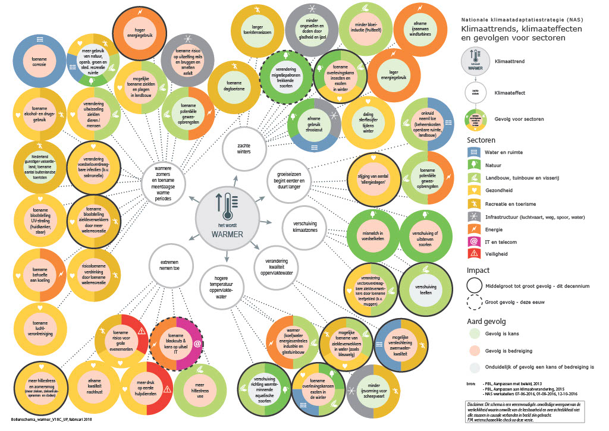
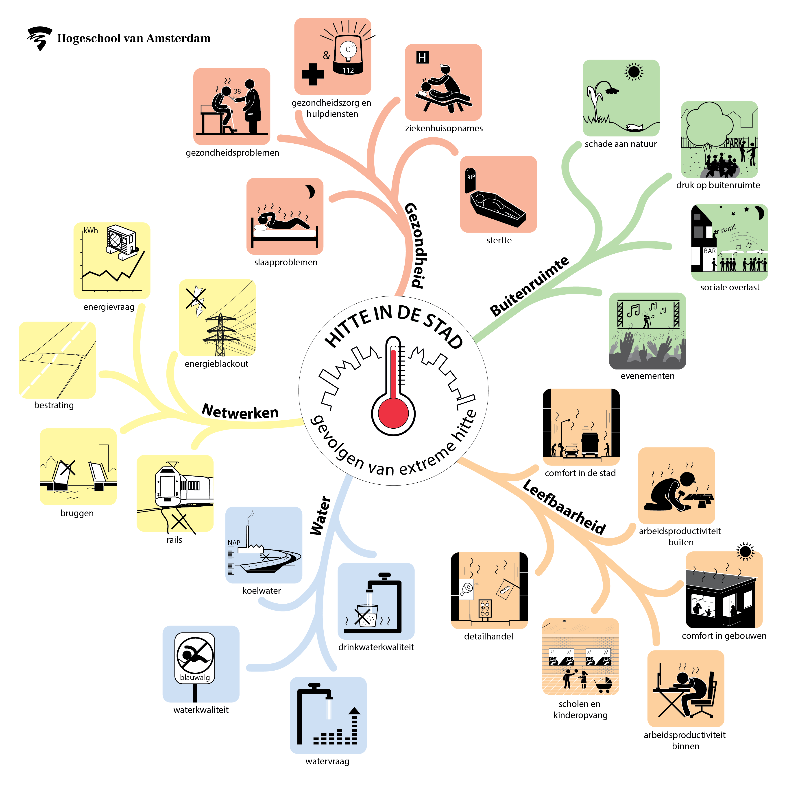

## Tools en informatiebronnen 
*Overzicht van bestaande tools en informatiebronnen voor hitte gerelateerde klimaatadaptatie-processen, -monitoring, opslag en verstrekking van klimaatadaptatiegegevens, etc. Eerst worden de belangrijkste tools beschreven en vervolgens wordt nog nader ingegaan op de verschillende Europese informatiebronnen.*

### Tools

#### Klimaateffectatlas (KEA)
De [Klimaateffectatlas](https://www.klimaateffectatlas.nl/nl/) is voor lokale en regionale overheid vaak het startpunt voor de [klimaatstresstest](#klimaatstresstesten). Daarnaast speelt de atlas ook een rol in de algemene bewustwording rondom klimaateffecten. De Klimaateffectatlas is gebaseerd op landelijke gegevens en geeft een eerste indruk van de gevolgen van klimaatverandering voor de verschillende gemeentes en regio’s in Nederland. Ook de Klimaateffectatlas maakt voor de klimaateffecten onderscheid in de vier klimaatrisico's: overstromingen, wateroverlast, droogte en hitte. De atlas bestaat uit een kaartviewer en kaartverhalen. 

##### Kaartverhalen met de belangrijkste kaarten
De kaartverhalen geven achtergrondinformatie bij de belangrijkste kaarten. Ze vertellen wat op de kaarten te zien is en helpen om met de informatie aan de slag te gaan. Daarnaast bieden de kaartverhalen handvatten voor mogelijke oplossingsrichtingen. 

Voor hitte zijn momenteel vijf kaartverhalen uitgewerkt:
- **Het wordt heter**: Dit kaartverhaal bevat de informatie van de KNMI-statistieken over hitte. Per weerstation zijn beschikbaar o.a. aantal warme, zomerse of tropische dagen, aantal tropische nachten en behoefte aan verkoeling van huizen.
- **Hittekaart - gevoelstemperatuur**: De hittekaart gevoelstemperatuur laat de lokale gevoelstemperatuur zien op een extreem hete zomermiddag. De gevoelstemperatuur geeft aan hoe warm een persoon het heeft in een bepaalde weersituatie. Als de gemeten luchttemperatuur bijvoorbeeld 30 ºC is, kan het in de volle zon en uit de wind voelen als 40 ºC. Daarnaast hebben ouderen en mensen met overgewicht vaak eerder last van een hogere gevoelstemperatuur, doordat ze hun warmte minder kwijt kunnen aan de omgeving. 
- **Hittekaart - Warme nachten**: Bij warme nachten is kans op hittestress. De kaart geeft een indicatie van het aantal tropische nachten voor het huidige klimaat (1981-2010) voor stedelijke gebieden. Bij tropische nachten komt de temperatuur niet onder de 20°C. Dit leidt tot risico's voor de gezondheid.
- **Afstand tot koelte**: De kaart toont koele plekken en de afstand tot deze plekken vanaf huizen en andere gebouwen in stedelijke gebieden in Nederland. Elk huis moet een aangename koele plek hebben binnen een loopafstand van 300 meter. Wanneer een plek koel is, is eigenlijk lastig te zegggen. Hiervoor zijn een aantal basiscriteria gebruikt met betrekking tot de grootte, temperatuur, afstand tot wegen en de vorm. 
- **Opwarming oppervlaktewater**: De kaart geeft een indicatie van het risico voor hoge watertemperaturen tijdens een zomer in het huidige klimaat. De watertemperatuur beïnvloedt namelijk de kwaliteit en de ecologische toestand van het water.

##### Basiskaarten
Voor het uitvoeren van de stresstesten biedt de klimaateffectatlas vier (typen) basiskaarten aan. Overheidsorganen die verplicht zijn de zesjaarlijkse stresstest uit te voeren, kunnen deze informatie gebruiken als vertrekpunt voor het uitvoeren van de test.

Belangrijke basiskaarten voor hitte in relatie tot gezondheid, natuur en infrastructuur zijn o.a.:
- Boom, groen, grijs en water per buurt
- Groen binnen openbare en niet openbare ruimte
- Wijktypologie
- Beweegbare bruggen

#### NAS-bollenschema's
In de Nationale klimaatadaptatiestrategie zijn de gevolgen van klimaatverandering visueel gemaakt in vier bollenschema’s. Deze bollenschema’s geven een samenvatting van de huidige wetenschappelijke kennis over de directe klimaateffecten en de indirecte gevolgen van de toenemende hitte, neerslag, droogte en zeespiegelstijging. De indidrecte gevolgen worden voor 9 sectoren, waaronder gezondheid, natuur en infrastructuur, in beeld gebracht. Hierbij wordt aangegeven of de impact een middelgroot tot groot gevolg dit decennium heeft of een groot gevolg deze eeuw. Ook wordt de aard van het gevolg aangegeven, namelijkj als een bedreiging, een kans of het is onduidelijk of het gevolg een kans of bedreiging is.

Voor hitte is het onderstaande schema beschikbaar:

<figure>
   
   <figcaption>NAS-bollenschema 'Het wordt warmer' (bron:
      <a href="https://nas-adaptatietool.nl/" target="_blank">NAS-adaptatietool</a>)
   </figcaption>
</figure>

Via de [NAS adaptatie tool](https://nas-adaptatietool.nl/) zijn de actueelste bollenschema's beschikbaar. 

Het bollenschema wordt als volledig beschouwd en kan worden gebruikt als overzicht van aandachtspunten.

#### Mindmap 'Hitte in de stad'
In de [Mindmap Hitte in de stad](https://www.hittebestendigestad.nl/mindmap/) zijn de problemen van extreme hitte verdeeld in vijf thema’s: gezondheid, netwerken, water, leefbaarheid en buitenruimte. Bij elk thema staan vier of vijf problemen waarvoor een factsheet beschikbaar is met aanvullende uitleg over het probleem, informatie en kaarten voor meer inzicht. Tot slot worden mogelijke maatregelen en richtlijnen gegeven om het probleem tegen te gaan. Voor de betreffende kaarten wordt onder meer verwezen naar de [Klimaateffectatlas](#klimaateffectatlas-kea).

<figure>
   
   <figcaption>Mindmap 'Hitte in de stad' (bron:
      <a href="https://www.hittebestendigestad.nl/mindmap/" target="_blank">Hogeschool van Amsterdam</a>)
   </figcaption>
</figure>

De mindmap wordt gebruikt in de [bijsluiter gestandaardiseerde stresstest hitte](#bijsluiter-gestandaardiseerde-stresstest-hitte).

#### Andere tools
Het [Kennisportaal Klimaatadaptatie](https://klimaatadaptatienederland.nl/) ondersteunt [NAS](#nationale-klimaatadaptatiestrategie-nas) en [DPRA](#deltaplan-ruimtelijke-adaptatie-dpra). Het geeft informatie over hoe Nederland zich voorbereidt op de gevolgen van klimaatverandering. 

Het kennisportaal biedt ook een overzicht van [hulpmiddelen](https://klimaatadaptatienederland.nl/hulpmiddelen/) die vanuit het DPRA ontwikkeld zijn, zoals de hierboven Klimaateffectatlas of de bijsluiter stresstesten. Voor hitte zijn nog meer hulpmiddelen beschikbaar. Deze worden hier niet beschreven, maar hiervoor wordt verwezen naar het kennisportaal. Voorbeelden van hitte gerelateerde hulpmiddelen op gebied van maatregelen zijn o.a.:
- Toolbox Klimaatbestendige Stad: verkent adaptatiemaatregelen voor wijk, straat of terrein;
- Hittestresstool: maatregelen tegen hittestress in de buitenruimte virtueel uitproberen en toetsen
- Cool Towns Heat Stress Measurement Protocol: meetprotocol om een Thermal Comfort Assessment op straatniveau uit te voeren;

### Europese informatiebronnen
In de [Europese Adaptatiestrategie](#europese-adaptatiestrategie) wordt aangegeven dat gegevens over klimaatgerelateerde risico’s en verliezen cruciaal zijn voor een betere nauwkeurigheid van de klimaatrisicobeoordeling. Om “klimaatblinde” beslissingen te vermijden, moeten gegevens van zowel de particuliere als de publieke sector op een omvattende en geharmoniseerde wijze worden geregistreerd, verzameld en gedeeld. In dit kader worden verschillende Europese gegevensbronnen genoemd:
- **Copernicus en EMODnet**: De Europese Adaptatiestrategie geeft aan dat alle gegevens van wetenschappelijke kerninitiatieven van de EU, zoals Copernicus en het Europees marien observatie- en datanetwerk (EMODnet) zijn vrij en openlijk beschikbaar voor alle gebruikers wereldwijd. De dienst van Copernicus voor klimaatverandering zal de bruikbaarheid van de gegevens verder verbeteren en diensten ontwikkelen zoals voor toewijzing van extreme weersverschijnselen. Daarnaast geeft de Europese Adaptatiestrategie aan dat ter onderbouwing van de besluitvorming gebruik moet worden gemaakt van de meest recente digitale technologieën en klimaatdiensten bevorderen (bijvoorbeeld teledetectie, slimme weerstations, kunstmatige intelligentie en high-performance computing). En nieuwe instrumenten zoals Destination Earth en Digital Twins zijn veelbelovend om het begrip van huidige en toekomstige klimaateffecten op planetaire en lokale schaal te vergroten. 
- **INSPIRE richtlijn, Richtlijn Open data en Richtlijn inzake het hergebruik van overheidsinformatie**: De Commissie wil de toegang voor belanghebbenden tot gegevens over klimaatgerelateerde risico’s en verliezen vergemakkelijken. De INSPIRE-richtlijn, de Richlijn inzake Open data en de richtlijn inzake het hergebruik van overheidsinformatie worden in dit kader genoemd. De INSPIRE richtlijn, welke in 2021 is geëvalueerd, zal als onderdeel van het GreenData4All initiatief worden uitgebreid zodat gegevens over milieu- en klimaatgerelateerde verliezen na rampen worden opgenomen en de reikwijdte van de publieke toegang wordt uitgebreid. Gegevens over klimaatgerelateerde verliezen na rampen worden ook beschouwd als hoogwaardige datasets bij toekomstige herzieningen van de uitvoeringshandeling van de richtlijn inzake open data en de richtlijn inzake het hergebruik van overheidsinformatie. Evenzo zullen de gegevens die in publiek-private partnerschappen worden verzameld zo toegankelijk mogelijk worden gemaakt.
- **Climate-ADAPT**: De Europese commissie wil [Climate-ADAPT](https://climate-adapt.eea.europa.eu/) verder ontwikkelen tot toonaangevend Europees platform voor de aanpassing aan de klimaatverandering. De Commissie wil Climate-ADAPT uitbreiden als kennisbron over klimaateffecten en -aanpassing, onder meer door diverse informatiebronnen te bundelen. Daarnaast gaat Climate-ADAPT als mechanisme dienen voor monitoring en verslaglegging. Tot slot wordt in het kader van Climate-ADAPT een Europese waarnemingspost voor klimaat en gezondheid opgericht. De Commissie wil gegevens, instrumenten en deskundigheid bijeenbrengen en met elkaar in verband brengen om de gevolgen van de klimaatverandering voor de gezondheid van de mens op basis van een “één gezondheid”-benadering bekend te maken, te monitoren, te analyseren en te voorkomen. Sterfte en verwondingen als gevolg van hitte, overstromingen of bosbranden worden in dit kader genoemd als ook de verschijning en verspreiding van infectieziekten en allergenen die verband houden met geografische verschuivingen in vectoren en pathogenen. 
