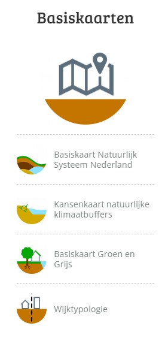
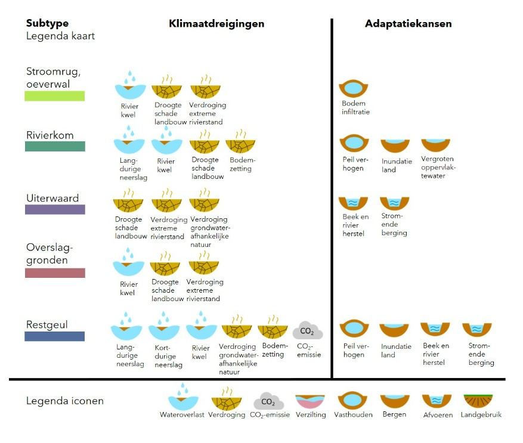

## Tools en hulpmiddelen 
*Overzicht van bestaande tools en hulpmiddelen voor klimaatadaptatie-processen, -monitoring, opslag en verstrekking van klimaatadaptatiegegevens, etc.* 

Zie ook https://klimaatadaptatienederland.nl/hulpmiddelen/overzicht/?zoeken=true&zoeken_term=&zoeken_trefwoord=&zoeken_trefwoord=17073&zoeken_trefwoord=.

### Klimaateffectatlas (KEA)
De Klimaateffectatlas (KEA) is gebaseerd op landelijke gegevens en geeft een eerste indruk van de gevolgen van klimaatverandering voor de verschillende gemeentes en regio’s in Nederland. De [Klimaateffectatlas](https://www.klimaateffectatlas.nl/nl/) maakt daarbij onderscheid tussen vier klimaattrends:
 - Wateroverlast
 - Droogte
 - Hitte
 - Overstroming

De atlas bestaat uit kaartverhalen en een kaartviewer met basisinformatie.

### Kaartverhalen
De kaartverhalen geven achtergrondinformatie bij de belangrijkste kaarten. Ze vertellen wat op de kaarten te zien is en helpen om met de informatie aan de slag te gaan. Daarnaast bieden de kaartverhalen handvatten voor mogelijke oplossingsrichtingen. Eén van kaartverhalen is 'Hitte'. 

<figure>
   
   <figcaption>Overzicht kaarverhalen (Bron:
      <a href="https://www.klimaateffectatlas.nl/nl/kaartverhalen" target="_blank">klimaateffectatlas (KEA)</a>)
   </figcaption>
</figure>

Voor hitte zijn de volgende kaartverhalen uitgewerkt:
- Het wordt heter: KNMI-Statistieken over hitte per weerstation o.a. aantal warme/zomerse/tropische dagen, aantal tropische nachten, behoefte verkoeling huizen
- Hittekaart gevoelstemperatuur: Gevoelstemperatuur geeft aan hoe warm een persoon het heeft in een bepaalde weersituatie. Als de gemeten luchttemperatuur bijvoorbeeld 30 ºC is, kan het in de volle zon en uit de wind voelen als 40 ºC. Daarnaast hebben ouderen en mensen met overgewicht vaak eerder last van een hogere gevoelstemperatuur, doordat ze hun warmte minder kwijt kunnen aan de omgeving. Hoge gevoelstemperatuur -> gezondheidsklachten 
- Warme nachten: Hittestress, gezondheidsrisico's (vermoeidheid, concentratieproblemen, hoofdpijn, risico op uitdroging en overhitting -> overlijden), stedelijk hitte-eiland
- Opwarming oppervlaktewater: Hoe verandert de waterkwaliteit door hitte?
- Afstand tot koelte: Wat is een koele plek? En de afstand tot koele plek: binnen 300 meter loopafstand; ca. 5 minuten lopen (bepaald via netwerkanalyse)

<aside class="note">Verder uitwerken</aside>

### Basiskaarten
Voor het uitvoeren van de stresstesten biedt de klimaateffectatlas vier (typen) basiskaarten aan. Overheidsorganen die verplicht zijn de zesjaarlijkse stresstest uit te voeren, kunnen deze informatie gebruiken als vertrekpunt voor het uitvoeren van de test.

<figure>
   
   <figcaption> De Basiskaarten (Bron:
      <a href="https://www.klimaateffectatlas.nl/nl/kaartverhalen" target="_blank">klimaateffectatlas (KEA)</a>)
   </figcaption>
</figure>

<aside class="note">Verder uitwerken</aside>

<aside class="example">

   <strong>Uitwerking werkproces basiskaart Natuurlijke Systemen.</strong>

   Hieronder staat kort beschreven hoe de Basiskaart Natuurlijk Systeem Nederland gegenereerd wordt. De kaart gaat gepaard met aanvullende informatie over elk legenda-element. Hiervoor worden de zowel de klimaatdreigingen als de adaptatiekansen schematisch weergegeven. 

   <strong>Analyse in vier stappen</strong>

   <figure>
      
      <figcaption> Basiskaart Natuurlijke Systeem Nederland (Bron:
         <a href="https://www.klimaateffectatlas.nl/nl/basiskaart-natuurlijk-systeem-nederland" target="_blank">klimaateffectatlas (KEA)</a>)
      </figcaption>
   </figure>

   <strong>Voorbeeld van een toepassing van die analyse</strong>

   <figure>
      
      <figcaption> Basiskaart Natuurlijke Systeem Nederland, voorbeeld: Rivierengebied (Bron:
         <a href="https://www.klimaateffectatlas.nl/nl/basiskaart-natuurlijk-systeem-nederland" target="_blank">klimaateffectatlas (KEA)</a>)
      </figcaption>
   </figure>
</aside>

<aside class="note">Verder uitwerken</aside>

### NAS-bollenschema ‘Het wordt warmer’

<aside class="note">Nog uitwerken</aside>

### Mindmap 'Hitte in de stad' (HvA)

<aside class="note">Nog uitwerken</aside>

### Bijsluiter gestandaardiseerde stresstest, onderdeel hitte
- Algemeen
- Standaard hittestresskaart: Gevoelstemperatuur (physiological equivalent temperatuur - PET)
- Leidraad stresstest hitte
- Cultuurhistorie als kennisbron voor stresstest

**Algemeen**
 1. Hoe maak je een gedetailleerde gevoelstemperatuurkaart?
 1. De kaart met het aantal warme nachten in de Klimaateffectatlas te bekijken.
 1. De kaart met de gevoelstemperatuur in de Klimaateffectatlas te bekijken.
 1. Ieder gevolg uit de mindmap hitte te overwegen: Speelt dat gevolg hier? Is de blootstelling relevant? Zo ja:
    * Waar speelt het?
    * Welke factoren beïnvloeden de gevoeligheid voor gevolgen?
    * Wat zijn de niet-klimatologische factoren die de omvang van de gevolgen kunnen beïnvloeden (bijv. vergrijzing in een bepaalde wijk)
    * Zijn er al maatregelen genomen, of nog niet?

<aside class="note">Verder uitwerken</aside>

### Cool Towns Heat Stress Measurement Protocol
(HvA)
https://www.cooltowns.eu/nl/protocol/: een volledige Thermal Comfort Assessment (TCA) op straatniveau uit te voeren.

<aside class="note">Verder uitwerken??</aside>

### EfFact checker
(HvA)

<aside class="note">Verder uitwerken??</aside>

### Hittestresstool
(Nelen & Schuurmans)

<aside class="note">Verder uitwerken??</aside>

### Tools kosten en/of effecten van hittemaatregelen
- Klimaatschadeschatter
- Klimaatmonitor
- ...

<aside class="note">Verder uitwerken??</aside>

--------------------
*Vragen:*

*Vraag 1: welke tools zijn belangrijk om uit te werken*

*Vraag 2: tools nog onderverdelen naar onderstaande indeling:*
- Bestaande Softwaresystemen
- Klimaatadaptatieprocessen
- klimaatadaptatie-monitoring
- opslag en verstrekking van klimaatadaptatiegegevens

*Vraag 3: kennis gegegevens EU hier nog opnemen?*
