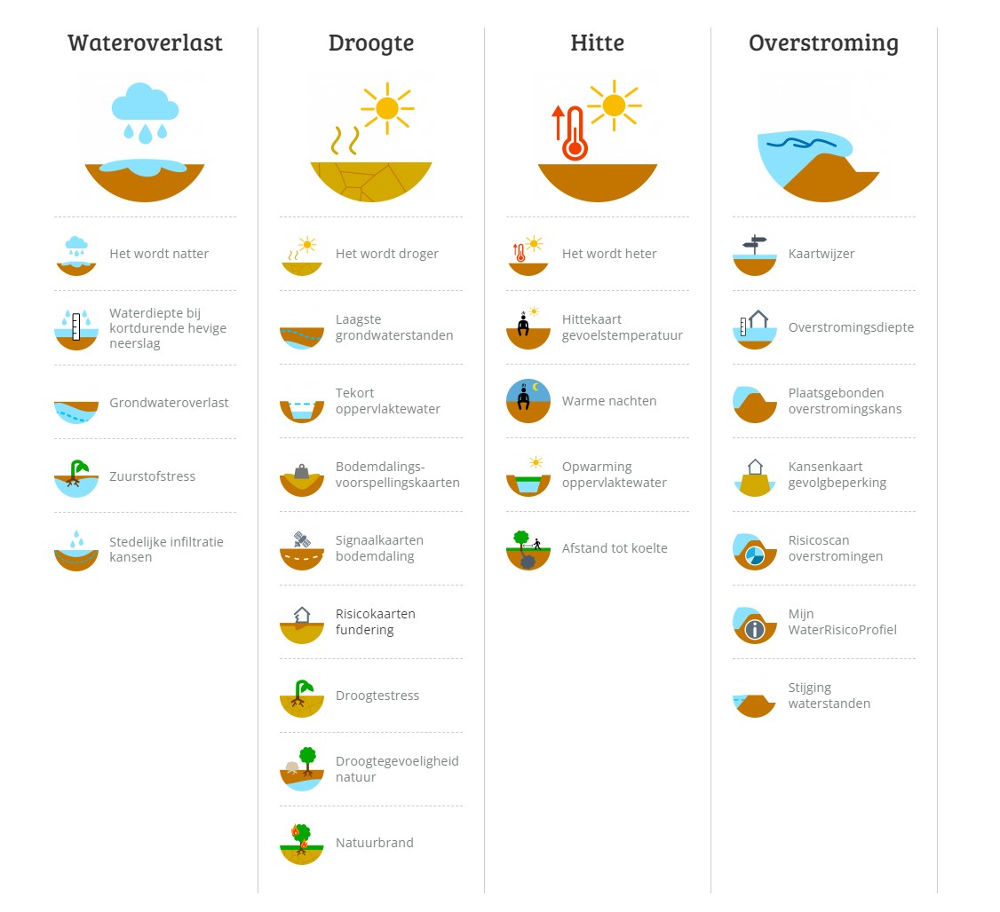
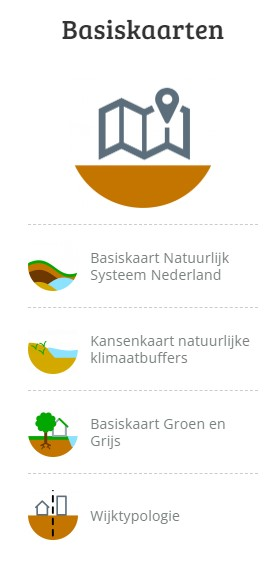
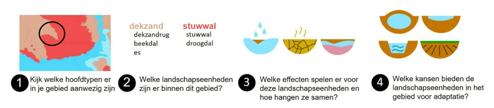

## Schets werkproces

*Globaal overzicht van (keten)werkproces(sen) waarin de data geproduceerd/gebruikt wordt.* 

<aside class="note"><strong>Nog verder uitwerken:</strong> 
   [Cool Towns Heat Stress Measurement Protocol](https://www.cooltowns.eu/nl/protocol/): een volledige Thermal Comfort Assessment (TCA) op straatniveau uit te voeren.
   Via https://klimaatadaptatienederland.nl/hulpmiddelen/overzicht/heat-stress-measurement-protocol/
</aside>

<aside class="note"><strong>Nog verder uitwerken:</strong> 
   Stresstest Hitte: https://klimaatadaptatienederland.nl/stresstest/bijsluiter/hitte/. Hier ook de link naar de rapporten met de gestandaardiseerde methode (RIVM rapport) en validatie (WUR rapport). Rapporten staan op Teams.
</aside>

### Onderzoeksvragen
 - In welke ketenprocessen met betrekking op klimaatadaptatie, speelt de KEA een rol?
 - Hoe zien die processen eruit?
 - Wie zijn de betrokken stakeholders en welke rol hebben zij?
 - Welke onderdelen in de keten zijn al gestandaardiseerd?
 - Hoe ziet de standaard nu uit?
 - Op welke punten in de keten is nog behoefte aan standaardisatie?
 - Welke data zijn noodzakelijk/wenselijk voor KEA
 - Welke bronnen zijn er?
 - Data al beschikbaar of beschikbaar te maken?

### Inleiding
Het informatiemodel klimaatadaptatie heeft de klimaateffectatlas (KEA) als vertrekpunt, maar beperkt zich niet uitsluitend hiertoe. De eerste versie van het informatiemodel klimaatadaptatie is gericht op het onderwerp _hitte_. De focus ligt in dit hoofdstuk daarom op dit onderwerp. Maar om goed antwoord te kunnen geven op bovenstaande onderzoeksvragen, bekijken we de KEA in dit hoofdstuk in een bredere context. Dit gebeurt mede omdat er een sterke samenhang is tussen te thema's en omdat de wens is om in een later stadium ook de andere thema's uit te werken in een informatiemodel.

### Doel
Het belangrijkste doel is dat <mark>de datasets</mark> op landelijk niveau en op een uniforme manier in de KEA beschikbaar komen. Dit geeft <mark>wie</mark> een beeld waaruit blijkt hoe klimaatadaptief Nederland is. De atlas is niet alleen waardevol voor <mark>wie?</mark>, maar voor lokale en regionale overheden, bijvoorbeeld als startpunt voor de zesjaarlijkse klimaatstresstest <mark>link</mark>. Voor een landelijk overzicht van de klimaatadaptiviteit van Nederland, is het uniformeren van de uitkomsten van stresstesten op dit moment geen haalbare kaart. De stresstest is een lokaal instrument. Hiervoor kán een lokale overheid data uit de KEA gebruiken, maar het staat hen vrij alternatieve of aanvullende informatiebronnen te gebruiken. Daarom onderzoeken wij aanvullend samen met stakeholders welke data zij gebruiken of nodig hebben én kunnen leveren. 

<aside class='note'>Ook nog iets zeggen over: onderwijsinstellingen, studenten, bedrijven en brugers</aside>

### Thema's
De KEA hanteert maakt onderscheid tussen vier thema's. Dit is dezelfde thematische indeling die de DPRA hanteert:
 - Wateroverlast
 - Droogte
 - Hitte
 - Overstroming

### Onderzoeksvragen
Deze thema's worden verder toegelicht binnen de kaartverhalen. <mark>...</mark> gaat hier kort wat verder op in. De KEA vult deze indeling aan met nog een thema: basiskaarten. Die lichten we kort toen in <mark>...</mark>. Dit hoofdstuk brengt in beeld welke werprocessen een raakvlak hebben met de KEA. Samengevat:
 - In welke ketenprocessen speelt de KEA een rol?
 - Hoe zien die processen eruit? En wie zijn de betrokken stakeholders?
 - Welke bronnen worden er gebruikt of zijn er beschikbaar?
 - Welke eisen ten aanzien van de kwaliteit van de data worden er gesteld?

### Kaartverhalen

Naast kaarten met informatie, biedt de KEA ook 'kaartverhalen' aan. Hierin wordt in een combinatie van kaarten en lopende tekst een bepaald thema verder uitgewerkt. Eén van die thema's is 'Hitte'. 

<figure>
   
   <figcaption>Overzicht kaarverhalen (Bron:
      <a href="https://www.klimaateffectatlas.nl/nl/kaartverhalen" target="_blank">klimaateffectatlas (KEA)</a>)
   </figcaption>
</figure>

<aside class="note">Verder uitwerken</aside>

### Basiskaarten
Voor het uitvoeren van de stresstesten biedt de klimaateffectatlas vier (typen) basiskaarten aan. Overheidsorganen die verplicht zijn de zesjaarlijkse stresstest uit te voeren, kunnen deze informatie gebruiken als vertrekpunt voor het uitvoeren van de test.

<figure>
   
   <figcaption> De Basiskaarten (Bron:
      <a href="https://www.klimaateffectatlas.nl/nl/kaartverhalen" target="_blank">klimaateffectatlas (KEA)</a>)
   </figcaption>
</figure>

<aside class="note">Verder uitwerken</aside>

<aside class="example">

   <strong>Uitwerking werkproces basiskaart Natuurlijke Systemen.</strong>

   Hieronder staat kort beschreven hoe de Basiskaart Natuurlijk Systeem Nederland gegenereerd wordt. De kaart gaat gepaard met aanvullende informatie over elk legenda-element. Hiervoor worden de zowel de klimaatdreigingen als de adaptatiekansen schematisch weergegeven. 

   <strong>Analyse in vier stappen</strong>

   <figure>
      
      <figcaption> Basiskaart Natuurlijke Systeem Nederland (Bron:
         <a href="https://www.klimaateffectatlas.nl/nl/basiskaart-natuurlijk-systeem-nederland" target="_blank">klimaateffectatlas (KEA)</a>)
      </figcaption>
   </figure>

   Voorbeeld van een toepassing van die analyse

   <figure>
      
      <figcaption> Basiskaart Natuurlijke Systeem Nederland, voorbeeld: Rivierengebied (Bron:
         <a href="https://www.klimaateffectatlas.nl/nl/basiskaart-natuurlijk-systeem-nederland" target="_blank">klimaateffectatlas (KEA)</a>)
      </figcaption>
   </figure>
</aside>

### Stresstest Hitte
"Uit de stresstest volgt ruimtelijk inzicht in kwetsbaarheden, nog zonder waardeoordeel. Of de kwetsbaarheden daadwerkelijk een probleem vormen en of er maatregelen moeten worden genomen, wordt afgewogen tijdens de risicodialoog."

"Het procesverloop van de risicodialoog ligt niet vast. Er zijn verschillende routes mogelijk. Maar meestal zal in wisselwerking met de stresstest een ‘van grof-naar-fijn-aanpak’ worden gevolgd. Daarbij wordt eerst, als voorbereiding op de dialoog, voor de vier klimaatthema’s een verkennende stresstest uitgevoerd met gebruik van landelijk of regionaal beschikbare basisinformatie. De resultaten hiervan zijn voeding voor de dialoog. Daar kan worden besloten dat meer informatie of meer detail nodig is. Er volgt dan een stap waarin informatie op maat wordt gecreëerd. Ook de resultaten hiervan gaan naar de dialoog. Het kan ook voorkomen dat eerst een risicodialoog plaatsvindt, nog voordat er een stresstest is uitgevoerd. Bijvoorbeeld na een calamiteit door extreem weer."

"De stappen in de stresstest en de wisselwerking tussen stresstest en risicodialoog zijn verbeeld in onderstaande infographic:"

<figure>
   
   <figcaption>Infographic Stresstest (Bron:
      <a href="https://klimaatadaptatienederland.nl/stresstest/bijsluiter" target="_blank">bijsluiter stresstest</a>)
   </figcaption>
</figure>

### Gebruik van Basisinformatie voor de stresstest hitte
 1. Hoe maak je een gedetailleerde gevoelstemperatuurkaart?
 1. De kaart met het aantal warme nachten in de Klimaateffectatlas te bekijken.
 1. De kaart met de gevoelstemperatuur in de Klimaateffectatlas te bekijken.
 1. Ieder gevolg uit de mindmap hitte te overwegen: Speelt dat gevolg hier? Is de blootstelling relevant? Zo ja:
    * Waar speelt het?
    * Welke factoren beïnvloeden de gevoeligheid voor gevolgen?
    * Wat zijn de niet-klimatologische factoren die de omvang van de gevolgen kunnen beïnvloeden (bijv. vergrijzing in een bepaalde wijk)
    * Zijn er al maatregelen genomen, of nog niet?