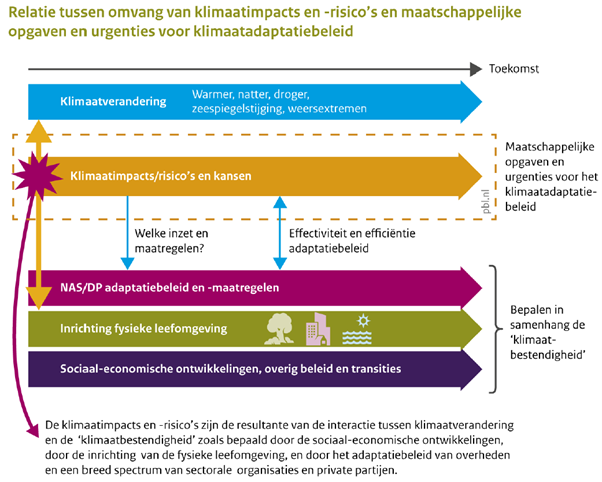

## Het (keten)werkproces klimaatadaptatie

*Globaal overzicht van (keten)werkproces(sen) waarin de data geproduceerd/gebruikt wordt.* 

In dit hoofdstuk wordt het algemene werkproces rondom klimaatadaptatie beschreven. 

### Klimaatstresstesten 
In het [Deltaplan Ruimtelijke Adaptatie (DPRA)](#deltaplan-ruimtelijke-adaptatie-dpra) is afgesproken dat heel Nederland in 2050 waterrobuust en klimaatbestendig is ingericht. Het Deltaplan gebruikt hiervoor zeven ambities, waarvan ‘kwetsbaarheden in beeld brengen’ er één is. Om die kwetsbaarheden in beeld te krijgen, moesten alle overheden uiterlijk in 2019 een klimaatstresstest uitvoeren. 

In een klimaatstresstest wordt geïdentificeerd wat de mogelijke kwetsbaarheden zijn binnen een gebied. Er wordt daarvoor een test gedaan voor de vier klimaatrisico's: wateroverlast, hitte, droogte en overstroming. De test bestaat in de kern uit:
- het verzamelen en creëren van informatie die beschrijft welke effecten klimaatverandering (de ‘stress’ die op het systeem wordt gezet) in de toekomst kan hebben, 
- en uit het combineren van deze informatie met verzamelde gegevens over de gevoeligheid van objecten en functies voor deze effecten. 
Om te bepalen waar en wanneer welke knelpunten hierdoor kunnen ontstaan, onder verschillende mogelijke klimaatontwikkelingen.

De stresstest gaat over het stedelijk en landelijk gebied. De stresstest onderzoekt de kwetsbaarheid van allerlei objecten en functies in een gebied, maar specifieke aandacht wordt gevraagd voor de vitale en kwetsbare functies. Dit zijn functies die cruciaal zijn voor rampenbeheersing, zoals de drinkwatervoorziening en functies die bij uitval of een calamiteit ernstige schade veroorzaken voor mens, milieu of economie.

Een belangrijk hulpmiddel om een stresstest uit te voeren is de **Klimaateffectatlas**. De Klimaateffectatlas levert input bij de eerste stap in de stresstest, namelijk om basisinformatie over kwetsbaarheden op te halen. De Klimaateffectatlas geeft een eerste indruk van de (toekomstige) dreigingen van wateroverlast, hitte, droogte en overstroming in Nederland. In het hoofdstuk [Tools/hulpmiddelen](#tools) staat de Klimaateffectatlas verder beschreven.

**Bijsluiter voor de gestandaardiseerde stresstest**

Overheden zijn vrij om zelf te bepalen hoe ze een stresstest uitvoeren. Om ze te ondersteunen heeft het [Deltaprogramma Ruimtelijke Adaptatie (DPRA)](#deltaplan-ruimtelijke-adaptatie-dpra) samen met een groot aantal partijen de *Bijsluiter voor de gestandaardiseerde stresstest* ontwikkeld. Daarin staat hoe een stresstest uitgevoerd kan worden. De bijsluiter is een bundeling van aanwijzingen voor het uitvoeren van de stresstest en helpt bij het interpreteren en toepassen van uitkomsten. Daarnaast wijst de bijsluiter op de keuzes die gemaakt moeten worden en helpt het bij het maken van deze keuzes. 

Per klimaatrisico is een bijsluiter ontwikkeld met specifieke aanwijzingen die passen bij het kenmerk van de risico, aanwijzingen over de informatie die beschikbaar is en over de gebruikersbehoeften. Verder geeft de bijsluiter adviezen voor het gebruik van de uitkomsten van de stresstest. De bijsluiter voor hitte staat beschreven in het hoofdstuk [Tools/hulpmiddelen](#tools). 

### Risicodialogen
Door de klimaatstresstesten komen de kwetsbaarheden in een gebied in beeld, maar nog zonder waardeoordeel. Of de kwetsbaarheden daadwerkelijk een risico vormen, het  beschermingsniveau en of er maatregelen moeten worden genomen, wordt afgewogen tijdens de risicodialoog.

De risicodialoog is één van de zeven ambities uit het [Deltaplan Ruimtelijke adaptatie](##deltaplan-ruimtelijke-adaptatie-dpra). Het is de stap tussen de stresstest en het maken van een uitvoeringsprogramma voor klimaatadaptatie. 

Het procesverloop van de risicodialoog ligt niet vast. Er zijn verschillende routes mogelijk. Maar meestal zal in wisselwerking met de stresstest een ‘van grof-naar-fijn-aanpak’ worden gevolgd. Daarbij wordt eerst, als voorbereiding op de dialoog, voor de vier klimaatrisico's een verkennende stresstest uitgevoerd met gebruik van landelijk of regionaal beschikbare basisinformatie. De resultaten hiervan zijn voeding voor de dialoog. Daar kan worden besloten dat meer informatie of meer detail nodig is. Er volgt dan een stap waarin informatie op maat wordt gecreëerd. Ook de resultaten hiervan gaan naar de dialoog. Maar het kan ook voorkomen dat eerst een risicodialoog plaatsvindt, nog voordat er een stresstest is uitgevoerd, bijvoorbeeld na een calamiteit door extreem weer.

"De stappen in de stresstest en de wisselwerking tussen stresstest en risicodialoog zijn verbeeld in onderstaande infographic:"

<figure>
   
   <figcaption>Infographic stresstest - risicodialoog (bron:
      <a href="https://klimaatadaptatienederland.nl/stresstest/bijsluiter" target="_blank">Bijsluiter gestandaardiseerde stresstest</a>)
   </figcaption>
</figure>

### Uitvoeringsagenda met maatregelenprogramma
Met het afronden van de risicodialoog komen de belanghebbenden in het gebied tot het opstellen van een (adaptatie)strategie of het maken van een (aanzet voor) een uitvoeringsagenda. Concrete afspraken worden vastgelegd over wat de belanghebbenden kunnen en willen doen om bij te dragen aan het klimaatbestendig inrichten van een gebied. De uitvoeringsagenda bevat de uitwerking in maatregelen op korte termijn en oplossingsrichtingen op lange termijn.

#### Impulsregeling klimaatadaptatie
Gemeenten, provincies en waterschappen kunnen via de Impulsregeling klimaatadaptatie een bijdrage van het Rijk krijgen voor klimaatadaptatiemaatregelen. Het maatregelpakket moet echter bijdragen aan het verminderen van de kwetsbaarheid van gebieden voor wateroverlast, droogte of de gevolgen van overstromingen. Hitte gerelateerde problematiek is hier geen onderdeel van. 

### Monitoring
Monitoring van klimaatadaptatie is het systematisch volgen en bijhouden van adaptatieontwikkelingen over een langere periode. Verschillende ontwikkelingen kunnen gemonitord worden, bijvoorbeeld van het adaptatiebeleid tot de werking van uitgevoerde maatregelen. Het PBL heeft in 2021 een [scopingstudie](https://www.pbl.nl/publicaties/navigeren-naar-een-klimaatbestendig-nederland) gepubliceerd om de uitvoering van het beleid voor de aanpassing aan klimaatverandering op kortere en langere termijn te monitoren. Het PBL schetst drie monitoringsvarianten. De varianten maken het mogelijk om in de gaten te houden hoe de klimaatimpacts en -risico’s zich ontwikkelen en hoe de uitvoering van het adaptatiebeleid verloopt: zijn het beleid en de maatregelen effectief? Komen de gestelde doelen binnen bereik? Waar en hoe moet er worden bijgestuurd?

Op basis van dit rapport is gekozen voor de eerste variant die zich richt op de **herijking van de klimaatimpacts en -risico's** tot 2026. In de herijking worden de klimaatimpacts en -risico’s voor 13 beleidsvelden (samen te vatten als economisch, persoonsgebonden/maatschappelijk, cultuurhistorisch en leefomgeving) uitgewerkt. Het PBL coördineert de herijking. Welke indicatoren voor de 13 beleidsvelden worden gehanteerd, is op dit moment nog niet precies bekend. Mogelijke indicatoren voor hitte zijn: oversterfte door hitte (CBS), schade door hitte en misschien hoeveel gemeenten een lokaal hitteplan hebben opgesteld. 

De effectiviteit van de maatregelen, die in kader van klimaatadaptatie worden genomen, worden in deze herijking niet worden gemonitord.

<figure>
   
   <figcaption>Het beheersen van de klimaatimpacts en -risico’s en het benutten van eventuele kansen die voortvloeien uit klimaatverandering vormen de maatschappelijk opgave en urgenties van het klimaatadaptatiebeleid (bron:
      <a href="https://www.pbl.nl/publicaties/navigeren-naar-een-klimaatbestendig-nederland" target="_blank">PBL, Navigeren naar een klimaatbestendig Nederland</a>)
   </figcaption>
</figure>

 
