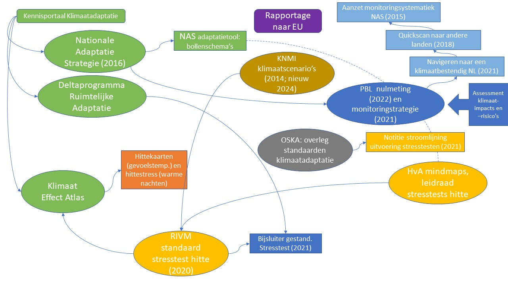

## Wettelijk kader

*Voor zover bekend is er geen wettelijk kader voor klimaatadaptatie, domein hitte. Er is een beleidskader en er zijn richtlijnen, vormen van standaarden, tools en vuistregels voor normen.*

### Hoe pakt Nederland klimaatadaptatie aan?
Om heel Nederland klimaatbestendig en waterrobuust in te richten, is het nodig dat klimaatadaptatie op alle overheidsniveaus onderdeel is van beleid en uitvoering. Daarvoor is in de eerste plaats een landelijke aanpak nodig. Die landelijke aanpak gebeurt vanuit twee programma’s: het Nationaal Deltaprogramma en de Nationale klimaatadaptatiestrategie (NAS).

 en Nationaal Deltaprogramma")

#### Nationaal Deltaprogramma 
In het [Nationaal Deltaprogramma](https://www.deltaprogramma.nl/) staat hoe de overheid Nederland beschermt tegen overstromingen, zorgt voor voldoende zoetwater en werkt aan een klimaatbestendige en waterrobuuste inrichting. Het Rijk, provincies, gemeenten, waterschappen, Rijkswaterstaat en verschillende maatschappelijke organisaties werken vanuit het Deltaprogramma samen aan deze opgaven, onder leiding van de deltacommissaris. 

Ruimtelijke adaptatie is een van de drie thema’s in het Deltaprogramma. Het algemene beleid is vastgelegd in de **Deltabeslissing Ruimtelijke adaptatie**. De kern daarvan is dat Nederland in 2050 waterrobuust en klimaatbestendig is ingericht. Het Rijk heeft de deltabeslissing en overig beleid voor ruimtelijke adaptatie vastgelegd in het ontwerp Nationaal Waterprogramma (NWP), de Nationale Omgevingsvisie en de **Nationale Klimaatadaptatiestrategie (NAS)**. Concrete maatregelen voor de uitvoering van het beleid staan beschreven in het **Deltaplan Ruimtelijke adaptatie (DPRA)**.

#### Deltaplan Ruimtelijke adaptatie (DPRA)
Het Deltaplan Ruimtelijke adaptatie (DPRA) is onderdeel van het nationaal Deltaprogramma. In het plan staat hoe gemeenten, waterschappen, provincies en het Rijk het proces van ruimtelijke adaptatie willen versnellen en intensiveren. In het deltaplan staan 7 ambities van de overheid voor een waterrobuust en klimaatbestendig Nederland in 2050. Het deltaplan geeft aan welke doelen de partijen nastreven, hoe ze daaraan gaan werken en hoe ze de resultaten in beeld brengen. Bij het deltaplan hoort een actieplan met concrete acties en maatregelen. De overheden werken met elkaar samen in 45 werkregio’s.

#### Nationale klimaatadaptatiestrategie (NAS)
De [Nationale klimaatadaptatiestrategie (NAS)](https://klimaatadaptatienederland.nl/publish/pages/120542/nas_rapport_5_1.pdf) is de overkoepelende Nederlandse strategie op het gebied van klimaatadaptatie. Deze strategie uit 2016 beschrijft de belangrijkste klimaatrisico’s voor Nederland en zet de koers uit om deze risico’s aan te pakken. Dit programma richt zich op sectoren, ketens, thema’s en klimaatrisico’s die niet in het Deltaprogramma en het Deltaplan Ruimtelijke adaptatie voorkomen en vult een aantal thema’s hieruit aan. De NAS brengt voor de vier klimaatrisico's (warmer, natter, droger en zeespiegelstijging) de effecten van klimaatverandering voor negen sectoren in beeld. 

De NAS is het Nederlandse antwoord op de oproep van de Europese Commissie aan alle lidstaten om uiterlijk in 2017 een klimaatadaptatiestrategie op te stellen. De NAS wordt op dit moment geëvalueerd.

#### Actielijnen klimaatadaptatie natuur
Voor het thema natuur is het beleidsdocument [Actielijnen klimaatadaptatie natuur](https://www.rijksoverheid.nl/documenten/rapporten/2021/03/31/actielijnen-klimaatadaptatie-natuur) van het KAN-team (interbestuurlijk projectteam) een relevant kader. Dit advies, dat de ministeries van IenW en van LNV in afstemming met VNG, IPO, UvW hebben opgesteld, is een direct gevolg van de Beleidstafel Droogte (opgericht na de extreme droogte in 2018) en de klimaatadaptatiedialogen (2017-2019) die het ministerie startte na verschijnen van de NAS.

Klimaatverandering heeft directe invloed op natuur, omdat de condities van de ecosystemen veranderen. Zowel droogte als wateroverlast als verzilting tasten natuurgebieden aan. Natuur wordt kwetsbaarder voor andere bedreigingen, zoals milieuverontreiniging en plagen. Daarnaast treedt er verschuiving van klimaatzones op, waardoor huidige soorten zich lastiger kunnen handhaven. Klimaatverandering vraagt om ingrepen in het bodem-watersysteem: water moet langer worden vastgehouden en ecosystemen worden vergroot en met elkaar verbonden. Klimaatbestendigheid van natuur moet daarom worden meegenomen en worden verbonden met de gezamenlijke natuur- en ontwikkelopgave van rijk en provincies.

Natuur is ook een maatregel voor klimaatadaptatie. Denk hierbij aan groene daken (isolatie), schaduwwerking (bomen) en waterbuffering (bodem). Hier staan ook nadelen tegenover, zoals de introductie van invasieven (daken) en muggen (wadi’s). Doordat het warmer wordt nemen zoönosen ook toe.

De volgende actielijnen zijn in het advies benoemd:
1.	Natuurdoelen en klimaatverandering: natuurdoelen houden voldoende rekening met klimaatverandering.
2.	Klimaatslim inrichten en beheren: ruimte voor water en natuur bestemmen, vergroenen en verbindingen met groen buiten stedelijk gebied.
3.	Toekomstbestendig gebruik ecosystemen: duurzaam gebruik ecosystemen.
4.	Natuur inclusieve oplossingen: natuur als ‘maatregel’ voor klimaatadapatie.

Deze vier actielijnen worden ondersteund door de actielijnen: Gebiedsgerichte uitwerking en Kennis & monitoring:
- Bij kennis wordt voorgesteld een kennisagenda te formuleren, gericht op kennistonwikkeling, maar ook op bewustwording en kennisdelen (best practices).
-	Bij monitoring wordt verwezen naar de herijking van de nulmeting (NAS) door PBL. Deze herijking zou idealiter moeten leiden tot een structurele en langdurige monitoring die gericht is op impacts van klimaatverandering voor alle relevante sectoren, op beleidseffectiviteit en op implementatie van maatregelen (zie [Monitoring](#monitoring)). Het KAN-team adviseert om daarbij specifiek aandacht te besteden aan mogelijkheden om standaarden voor klimaatadaptief groen (op basis van systeemaanpak) in normen/regelgeving bij overheden op te nemen. Daarnaast is er behoefte aan inzicht in hoe de gevolgen van klimaatverandering op de natuur- en klimaatadaptiemaatregelen voor natuur gevolgd kunnen worden en hoe deze informatie gebruiksklaar kan worden gemaakt voor de planning, monitoring en evaluatie van klimaatadaptatie natuur in relevante transities. Het Programma Natuur werkt een zes-jaarlijkse monitoringcyclus uit, die aansluit bij de bestaande landelijke monitoring van de beheerplannen (van provincies, Natura 2000). Onderdeel van de monitor is o.a. stijgende temperaturen. Aangesloten wordt op de natuurtellingen die provincies al uitvoeren. De bijdrage aan monitoring van klimaatadaptatie van natuur zelf maakt onderdeel uit van het onderzoeksprogramma van PBL.

### Normen en richtlijnen
Voor zover bekend is er geen wettelijk (normen)kader. Wel zijn er vuistregels en richtlijnen (in de maak).

#### Richtlijnen 'De hittebestendige stad’
De Hogeschool van Amsterdam heeft in 2020 gerapporteerd over een [praktijkonderzoek Hitte-richtlijnen](https://www.hva.nl/urban-technology/gedeelde-content/publicaties/publicaties-algemeen/praktijkonderzoek-hitte-richtlijnen.html). Dit praktijkonderzoek Hitte-richtlijnen is een samenwerking van TAUW, Hogeschool van Amsterdam, Delta Programma Ruimtelijke Adaptatie en de deelnemende gemeenten. Aanleiding was dat gemeenten hebben aangegeven voor hitte behoefte te hebben aan concrete richtlijnen voor een hittebestendige stad. In het RAAK-project [‘De hittebestendige stad’](https://klimaatadaptatienederland.nl/actueel/actueel/interviews/hittebestendige-stad/) zijn naar aanleiding van deze behoefte **drie ontwerprichtlijnen** voor een hitte bestendige inrichting van de buitenruimte opgesteld:
1.	Afstand tot koelte: Iedere woning moet zich voldoende dicht bij een aangename en aantrekkelijke koele verblijfsplek bevinden (voorstel: binnen 300 m).
2.	Percentage schaduw op belangrijke looproutes en in buurten: Er is op het heetst van de dag voldoende schaduw (voorstel minimaal 40% op belangrijke looproutes), zodat essentiële functies in de stad voor iedereen bereikbaar blijven.’
3.	Percentage groen per buurt: Er moet zoveel groen zijn dat er verdamping kan optreden en de gemiddelde luchttemperatuur wordt beperkt (voorstel afhankelijk per wijktype).

Voor elke van de richtlijnen worden de methode, resultaten en aanbevelingen beschreven, zodat de aanpak eenvoudig opschaalbaar is naar andere  gemeenten.
Deze richtlijnen zijn relevant voor de scope van dit document.

####  Bouwbesluit
Per 1 januari 2021 moet alle nieuwbouw voldoen aan de nieuwe [BENG (Bijna EnergieNeutrale Gebouwen) eisen](https://www.rvo.nl/onderwerpen/wetten-en-regels-gebouwen/beng/indicatoren). TOjuli staat voor "TemperatuurOverschrijding juli" en is een aanvullende eis. TOjuli is een indicator voor verlaging van het risico op oververhitting. De definitieve grenswaarde voor TOjuli is nu vastgesteld op 1,20 en geldt voor nieuw te bouwen woningen. Deze waarde is aangepast ten opzicht van de eerder voorlopig bepaalde grenswaarde van 1,00.

Deze normen hebben betrekking op bouwen en vallen daarom buiten scope van dit document.

### Internationaal en Europees kader
Overal op aarde hebben landen te maken met klimaatverandering. Daarom is klimaatadaptatie op internationaal niveau heel belangrijk. Het [klimaatverdrag van Parijs](https://wetten.overheid.nl/BWBV0006603/2017-08-27#Verdrag_2) uit 2015 maakt dit duidelijk door naast mitigatie ook aandacht te geven aan klimaatadaptatie. En ook de strategie van de Europese Commissie, Europese Green Deal geeft aan hoe belangrijk het klimaat is.

#### Europese Green Deal
De [Europese Green Deal](https://ec.europa.eu/info/strategy/priorities-2019-2024/european-green-deal_nl) is een nieuwe groeistrategie, die Europa moet omvormen tot een eerlijke en welvarende samenleving, met een moderne, hulpbronnenefficiënte en concurrerende economie, waar vanaf 2050 netto geen broeikasgassen meer worden uitgestoten en economische groei is losgekoppeld van het gebruik van hulpbronnen. De Green Deal maakt integraal deel uit van de strategie van de Commissie om de doelstellingen voor duurzame ontwikkeling van de Agenda 2030 van de Verenigde Naties te verwezenlijken.

De Green Deal is het programma van de Commissie Von der Leyen om klimaatverandering tegen te gaan. Met deze Green Deal moet Europa het eerste klimaat-neutrale continent worden: voor 2050 dient de Europese Unie niet meer bij te dragen aan de opwarming van de aarde door de uitstoot van broeikasgassen. Om Europa voor 2050 klimaatneutraal te maken, is er een routekaart uitgestippeld met een hele reeks aan wetgeving en maatregelen.

Een van de acht geformuleerde doelstellingen is de doelstelling voor klimaat: het verhogen van het EU-ambitieniveau aangaande het klimaat in 2030 en 2050.

#### Europese Klimaatwet
De [Europese Klimaatwet](https://ec.europa.eu/clima/policies/eu-climate-action/law_nl) schrijft het doel in de Europese Green Deal voor de Europese economie en samenleving om tegen 2050 klimaatneutraal te worden in de wet. De wet stelt ook het tussentijdse doel om de netto-uitstoot van broeikasgassen tegen 2030 met ten minste 55% te verminderen, vergeleken met het niveau van 1990. Deze wet geeft tevens aan hoe belangrijk klimaatadaptatie is.  

#### Europese Adaptatiestrategie 
In 2013 heeft de Europese Commissie haar eerste Europese Strategie voor klimaatadaptatie opgesteld. Een belangrijk deel van deze strategie is dat alle lidstaten een Nationale Adaptatie Strategie opstellen. In Nederland is dit de [NAS](##nationale-klimaatadaptatiestrategie-nas).

Op 24 februari 2021 heeft de Commissie een herziene [Europese Adaptatiestrategie](https://ec.europa.eu/clima/eu-action/adaptation-climate-change/eu-adaptation-strategy_en) aangenomen. Door voort te bouwen op de eerste strategie wil de Commissie lidstaten stimuleren om sneller adaptiemaatregelen te nemen en deze maatregelen op een grote schaal in te voeren.
